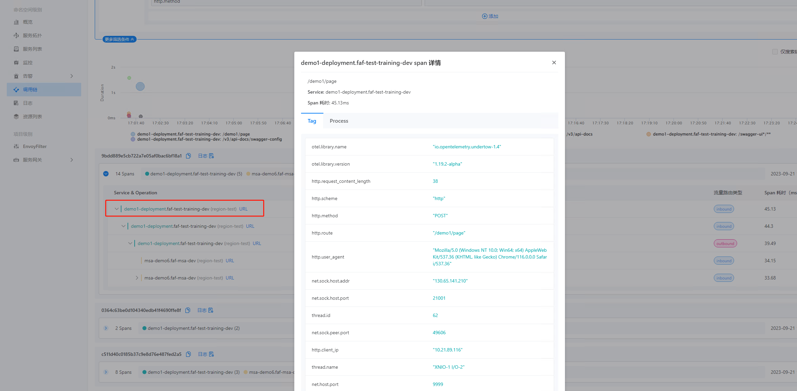
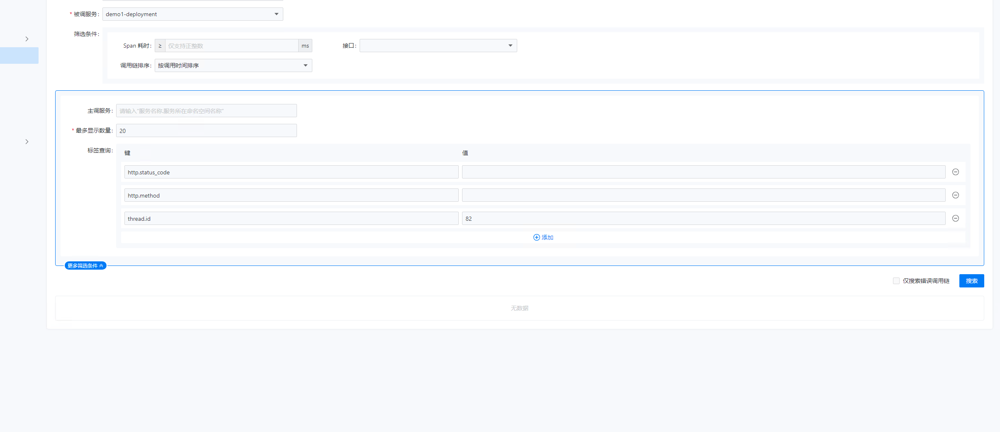
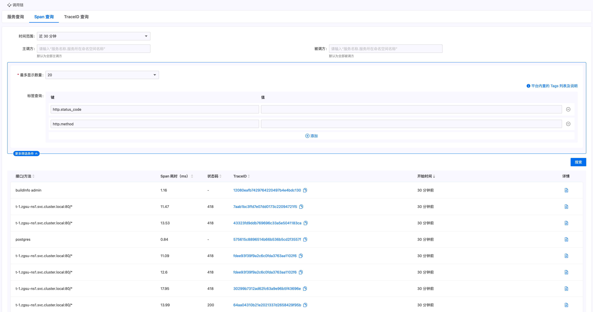

---
kind:
  - Troubleshooting
products:
  - Alauda Container Platform
  - Alauda DevOps
  - Alauda AI
  - Alauda Application Services
  - Alauda Service Mesh
  - Alauda Developer Portal
ProductsVersion:
  - 4.1.0,4.2.x
---
<!-- A type of document that involves encountering a fault, diagnosing it, performing root cause analysis, and providing solutions. -->

# ASM调用链查询被调服务链路信息

无法查询被调服务的下一跳链路信息 通过thread.id标签查询数据无结果

## Cause
- 平台3.12.2版本设计限制，选择被调服务时只能查询被调服务的tag

## Resolution
- 升级到3.14版本，该版本支持不输入主被调服务时查询任意span的tag

## [workaround]

## [Related Information]
**Screenshots**

- Environment: 3.12.2
- thread.id
- 被调服务
- 主被调服务
- span
- tag
- Component: (待归类)
- Page ID: 164997087
- Original Title: ASM调用链查询被调服务链路信息
