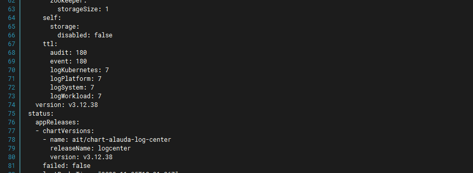
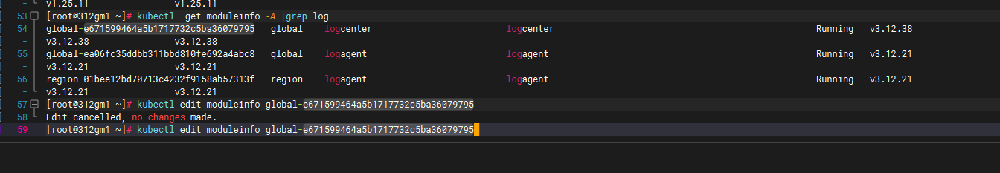

---
kind:
  - Troubleshooting
products:
  - Alauda Container Platform
  - Alauda DevOps
  - Alauda AI
  - Alauda Application Services
  - Alauda Service Mesh
  - Alauda Developer Portal
ProductsVersion:
  - 4.1.0,4.2.x
---
<!-- A type of document that involves encountering a fault, diagnosing it, performing root cause analysis, and providing solutions. -->

# 审计日志设置保存180天，但实际只能查到7天内的记录

审计日志设置保留180天，实际只能查询7天内的记录

## Cause
- moduleinfo日志存储策略中global logcenter的event保留时间被设置为7天

## Resolution
- 将moduleinfo日志存储策略中event的ttl值从7天调整为180天

## [workaround]

## [Related Information]
**Screenshots**
3. 
- Environment: JIRA
- 日志存储插件
- moduleinfo
- global logcenter
- 审计日志保留参数
- Component: (待归类)
- Page ID: 168313433
- Original Title: 审计日志设置保存180天，但实际只能查到7天内的记录
