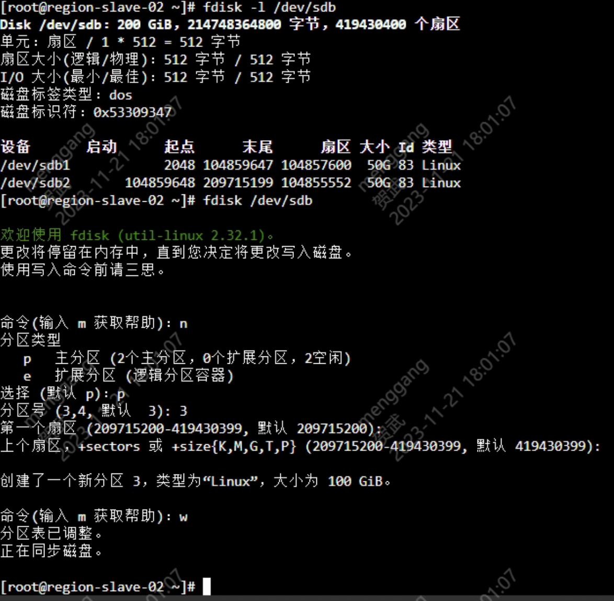
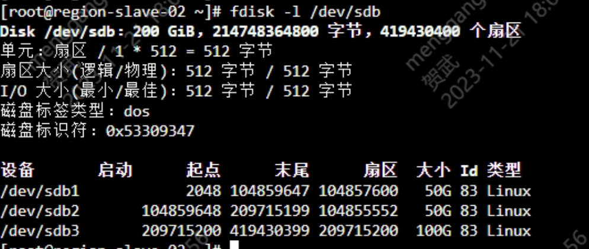
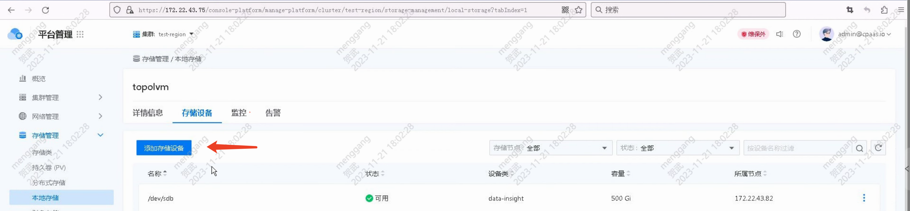
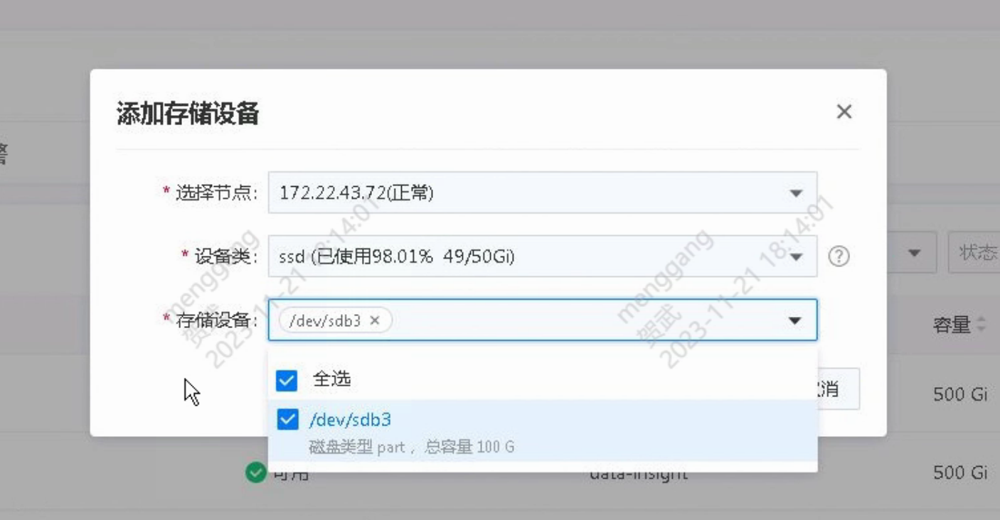

---
kind:
  - Troubleshooting
products:
  - Alauda Container Platform
  - Alauda DevOps
  - Alauda AI
  - Alauda Application Services
  - Alauda Service Mesh
  - Alauda Developer Portal
ProductsVersion:
  - 4.1.0,4.2.x
---
<!-- A type of document that involves encountering a fault, diagnosing it, performing root cause analysis, and providing solutions. -->

# 扩容topolvm节点空间

## 环境信息 适用版本：3.12.1

## Cause

## Resolution
- fdisk查看/dev/sdb已分区100G，还剩100G
- 添加新分区/dev/sdb3，容量为100G
- fdisk确认/dev/sdb已经有新分区
- 通过平台管理界面在本地存储添加存储设备
- 选择对应节点、相同设备类和新加存储设备
- 等待10分钟后刷新页面，等待topolvm后台扩容完成

## [workaround]

## [Related Information]
**Screenshots**

- Environment: 3.12.1
- topolvm
- /dev/sdb3
- 设备类
- 存储设备
- Component: (待归类)
- Page ID: 172526152
- Original Title: 扩容topolvm节点空间
