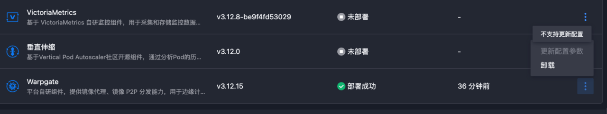
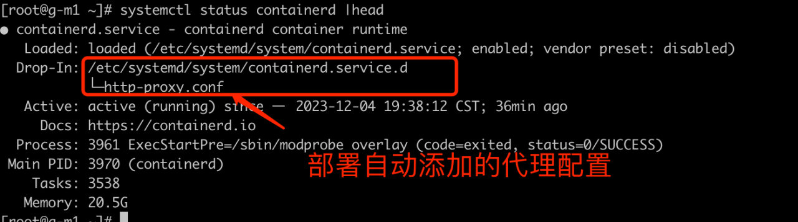
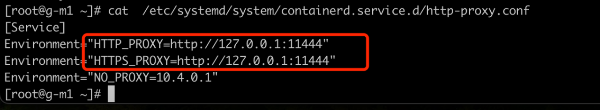

---
kind:
  - Troubleshooting
products:
  - Alauda Container Platform
  - Alauda DevOps
  - Alauda AI
  - Alauda Application Services
  - Alauda Service Mesh
  - Alauda Developer Portal
ProductsVersion:
  - 4.1.0,4.2.x
---
<!-- A type of document that involves encountering a fault, diagnosing it, performing root cause analysis, and providing solutions. -->

# 容器平台warpgate p2p 使用

镜像拉取速度未提升 多个节点同时下载镜像导致带宽消耗过高 断点续传失败

## Cause
- 11444端口被占用
- docker/containerd代理配置错误
- 节点间网络策略限制通信
- 镜像仓库不在支持列表中
- 延迟下载机制未正确触发

## Resolution
- 检查并释放11444端口
- 验证docker/containerd的http代理配置
- 调整网络策略允许节点间通信
- 确保使用Harbor/Docker Registry/JFrog镜像仓库
- 重新部署warpgate插件

## [workaround]
- 手动配置docker/containerd的http代理
- 临时关闭占用11444端口的服务
- 直接从镜像仓库拉取镜像绕过P2P

## [Related Information]
**Screenshots**

- Environment: 3.10,3.12
- 11444端口
- /etc/systemd/system/docker.service.d/http-proxy.conf
- containerd配置
- warpgate DaemonSet
- Harbor/Docker Registry/JFrog
- Component: warpgate
- Page ID: 175277254
- Original Title: 容器平台warpgate p2p 使用
