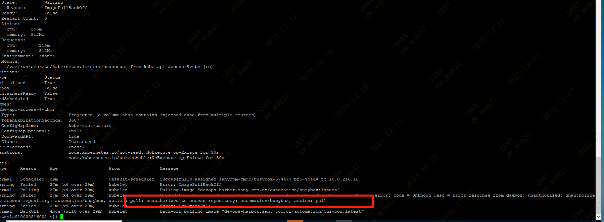
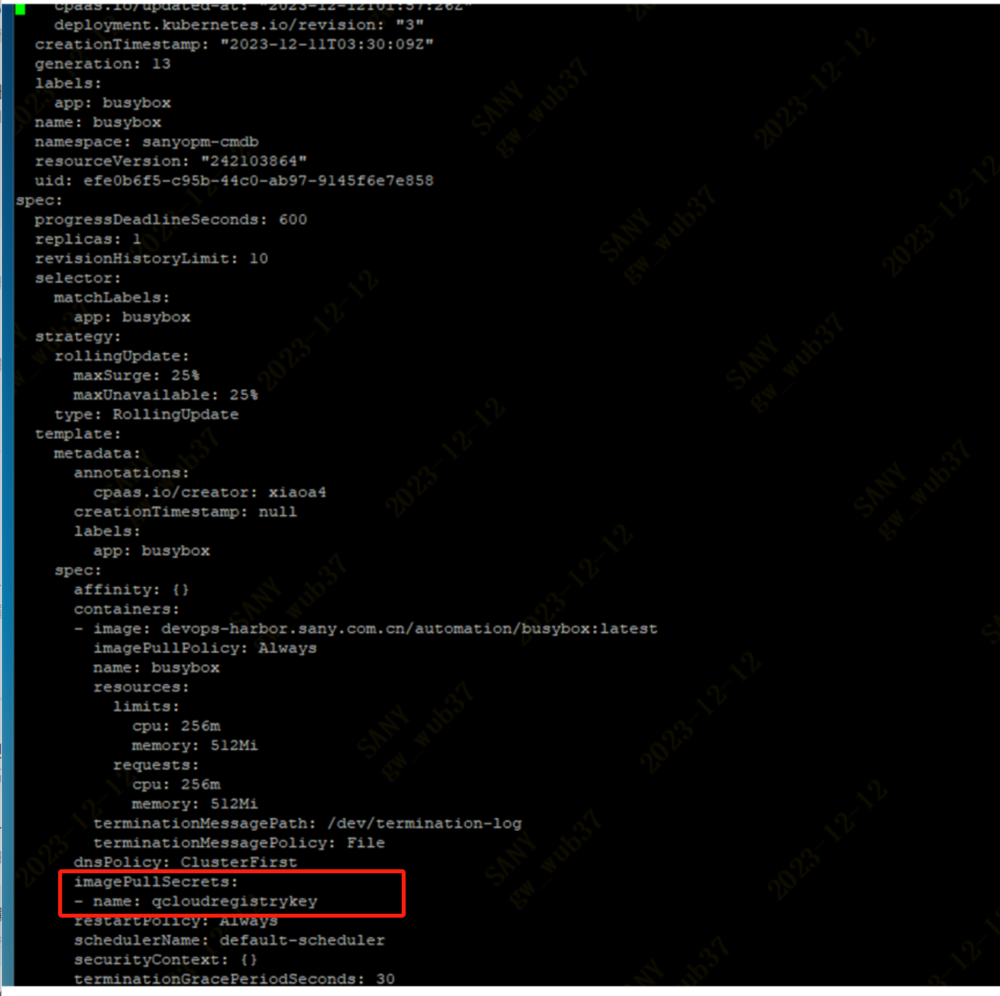
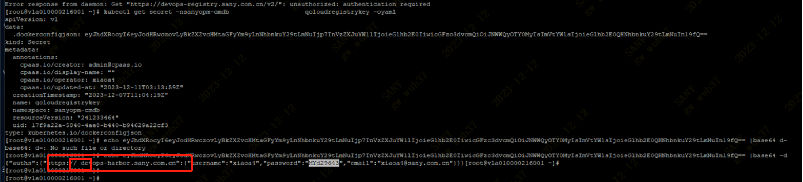

---
kind:
  - Troubleshooting
products:
  - Alauda Container Platform
  - Alauda DevOps
  - Alauda AI
  - Alauda Application Services
  - Alauda Service Mesh
  - Alauda Developer Portal
ProductsVersion:
  - 4.1.0,4.2.x
---
<!-- A type of document that involves encountering a fault, diagnosing it, performing root cause analysis, and providing solutions. -->

# 服务镜像拉取镜失败报错权限问题，检查保密字典配置了镜像服务，部署组绑定了镜像凭据，且验证了账密和权限都正确。

服务镜像拉取失败报错权限问题

## Cause
- 镜像服务认证信息经base64解析后地址部分存在特殊字符空格

## Resolution
- 重新生成并更新仓库认证文件，确保地址无特殊字符或空格

## [workaround]

## [Related Information]
**Screenshots**

- Environment: 通用
- 保密字典
- 镜像凭据
- dockerconfigjson
- base64
- Component: (待归类)
- Page ID: 176882369
- Original Title: 服务镜像拉取镜失败报错权限问题，检查保密字典配置了镜像服务，部署组绑定了镜像凭据，且验证了账密和权限都正确。
