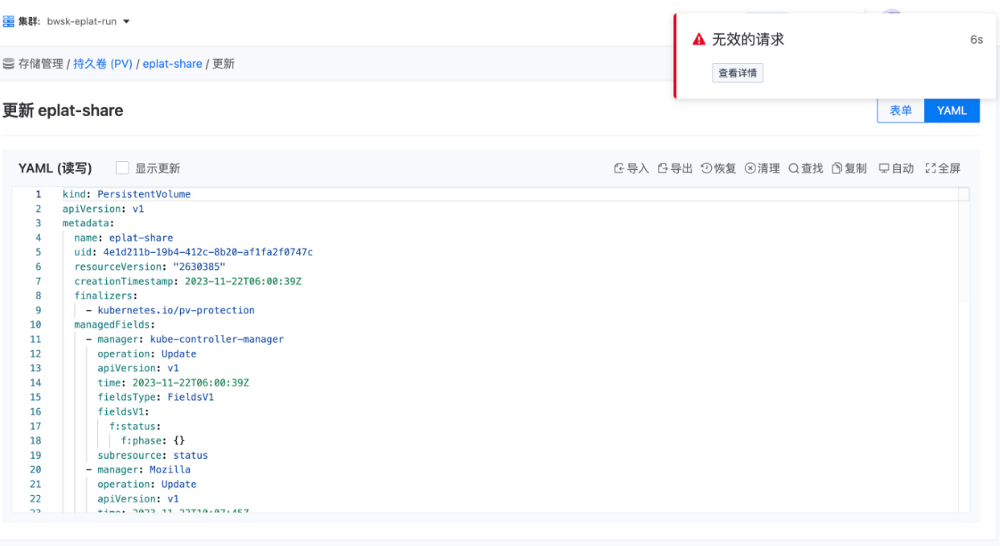

---
kind:
  - Troubleshooting
products:
  - Alauda Container Platform
  - Alauda DevOps
  - Alauda AI
  - Alauda Application Services
  - Alauda Service Mesh
  - Alauda Developer Portal
ProductsVersion:
  - 4.1.0,4.2.x
---
<!-- A type of document that involves encountering a fault, diagnosing it, performing root cause analysis, and providing solutions. -->

# 3.12.2

更新PV的YAML时无修改请求也会报错

## Cause
- PV的annotations字段被设置为空字符串""而非空对象{}

## Resolution
- 手动将annotations字段值从""修改为{}

## [workaround]

## [Related Information]
**Screenshots**

- Environment: 3.12.2
- annotations
- Component: (待归类)
- Page ID: 178228534
- Original Title: 3.12.2-PV更新yaml时，无任何修改请求也会报错
