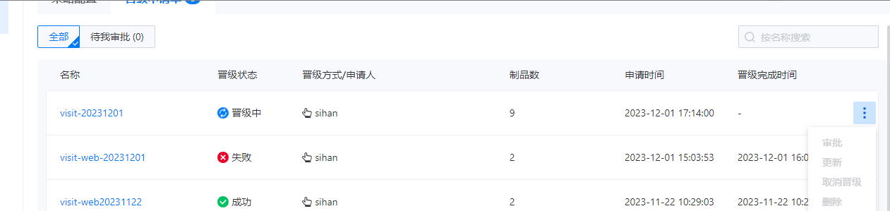

---
kind:
  - Troubleshooting
products:
  - Alauda Container Platform
  - Alauda DevOps
  - Alauda AI
  - Alauda Application Services
  - Alauda Service Mesh
  - Alauda Developer Portal
ProductsVersion:
  - 4.1.0,4.2.x
---
<!-- A type of document that involves encountering a fault, diagnosing it, performing root cause analysis, and providing solutions. -->

# 3.12.1

制品晋级卡死 服务pod无法创建 资源不足报错

## Cause
- 命名空间资源配额不足

## Resolution
- 调整制品晋级所在命名空间的资源配额

## [workaround]

## [Related Information]
**Screenshots**

- Environment: 3.12.1
- 命名空间资源配额
- 服务pod创建
- 制品晋级任务
- Component: (待归类)
- Page ID: 178228557
- Original Title: 3.12.1-制品晋级卡死-命名空间资源配额不足
