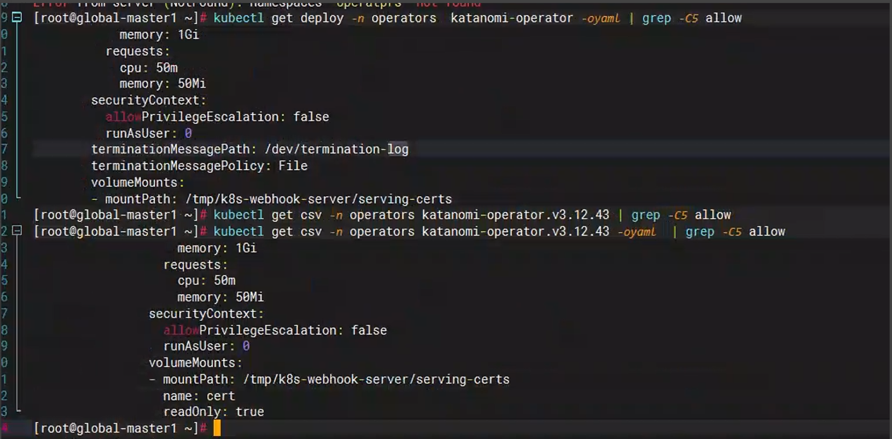

---
kind:
  - Troubleshooting
products:
  - Alauda Container Platform
  - Alauda DevOps
  - Alauda AI
  - Alauda Application Services
  - Alauda Service Mesh
  - Alauda Developer Portal
ProductsVersion:
  - 4.1.0,4.2.x
---
<!-- A type of document that involves encountering a fault, diagnosing it, performing root cause analysis, and providing solutions. -->

# 3.12.2

katanomi-operator的deploy副本为0 katanomi controller和plugin处于创建状态，无时间报错信息 katanomi-api日志报错panic: runtime error: invalid memory address or nil pointer dereference

## Cause
- katanomi组件缺少securityContext.runAsUser:0配置
- NonRoot参数未设置为false
- katanomi-api未设置group和user为0

## Resolution
- 停止katanomi-operator(设置operator副本为0)
- 在所有katanomi组件(katanomi-operator/controller/plugin/api)的deployment中添加securityContext.runAsUser:0
- 将NonRoot参数改为false
- 在katanomi-api中设置securityContext.runAsUser和runAsGroup都为0

## [workaround]

## [Related Information]
**Screenshots**

- Environment: 3.12.2
- katanomi-operator
- katanomi-controller
- katanomi-plugin
- katanomi-api
- securityContext.runAsUser
- securityContext.runAsGroup
- securityContext.allowPrivilegeEscalation
- Component: (待归类)
- Page ID: 179603916
- Original Title: 3.12.2-devops-global下的katanomi组件未正常启动
