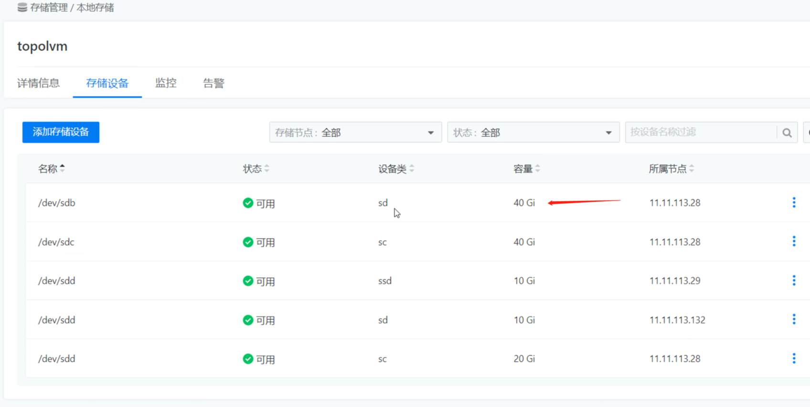
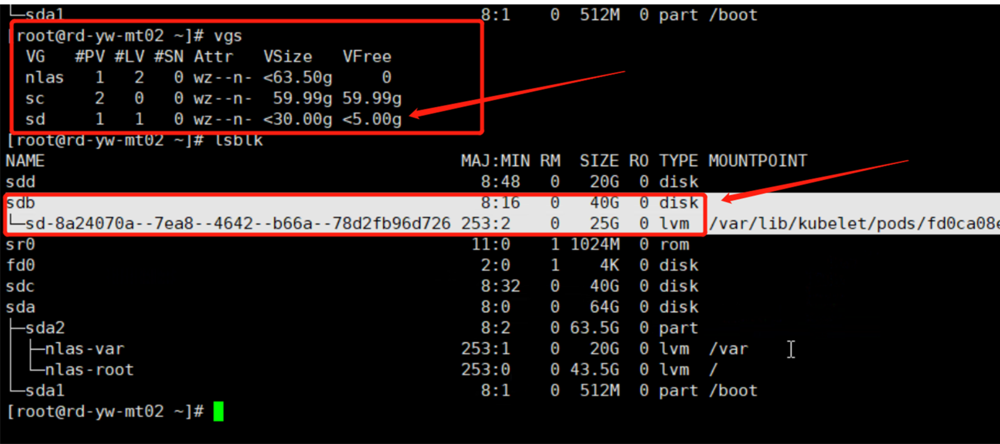

---
kind:
  - Troubleshooting
products:
  - Alauda Container Platform
  - Alauda DevOps
  - Alauda AI
  - Alauda Application Services
  - Alauda Service Mesh
  - Alauda Developer Portal
ProductsVersion:
  - 4.1.0,4.2.x
---
<!-- A type of document that involves encountering a fault, diagnosing it, performing root cause analysis, and providing solutions. -->

# 3.8.3

后台查询topolvm创建的vg未扩容，sdb盘从30G扩容到40G后，vgs显示未扩容 PVC从25G扩容到35G，页面显示已变更，但实际容量仍为25G

## Cause
- topolvm未自动将新增空间关联到物理卷
- PVC扩容后未重启对应容器

## Resolution
- 手动执行命令 pvresize /dev/<物理卷名> 关联新空间
- 重启对应容器使PVC扩容生效

## [workaround]

## [Related Information]
**Screenshots**

- Environment: 3.8+
- topolvm
- pvresize
- PVC
- VG
- /dev/sdb
- Component: (待归类)
- Page ID: 179603963
- Original Title: 3.8.3-容器平台-扩容topolvm的磁盘未生效
