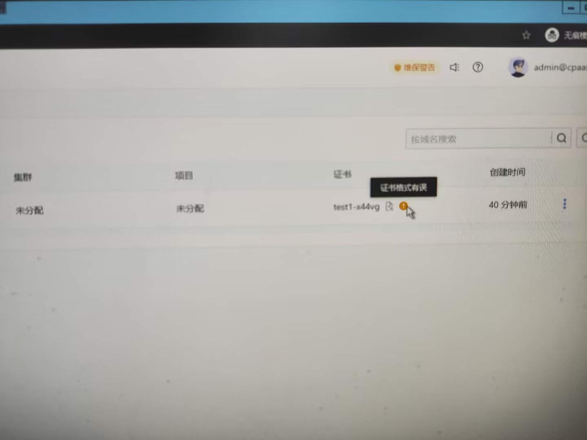

---
kind:
  - Troubleshooting
products:
  - Alauda Container Platform
  - Alauda DevOps
  - Alauda AI
  - Alauda Application Services
  - Alauda Service Mesh
  - Alauda Developer Portal
ProductsVersion:
  - 4.1.0,4.2.x
---
<!-- A type of document that involves encountering a fault, diagnosing it, performing root cause analysis, and providing solutions. -->

# 更新域名数据开启证书的公钥私钥没有校验

更新域名开启证书时，不填写公钥和私钥也能成功更新

## Cause
- 平台未对域名证书更新时的公钥和私钥字段做非空校验

## Resolution
- 等待后续版本优化解决证书校验逻辑

## [workaround]

## [Related Information]
**Screenshots**

- Environment: 3.14.2
- 域名更新接口
- 证书管理模块
- Component: (待归类)
- Page ID: 204507787
- Original Title: 容器平台-更新域名数据开启证书的公钥私钥没有校验
