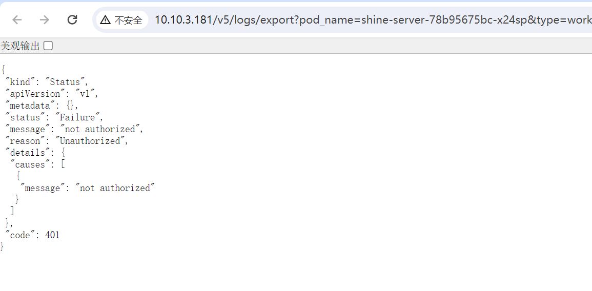

---
kind:
  - Troubleshooting
products:
  - Alauda Container Platform
  - Alauda DevOps
  - Alauda AI
  - Alauda Application Services
  - Alauda Service Mesh
  - Alauda Developer Portal
ProductsVersion:
  - 4.1.0,4.2.x
---
<!-- A type of document that involves encountering a fault, diagnosing it, performing root cause analysis, and providing solutions. -->

# 日志导出报401

日志导出报错401 浏览器请求返回'No request cookie were sent'

## Cause
- 浏览器问题导致无法发送cookie

## Resolution
- 更换电脑（更换浏览器环境）

## [workaround]

## [Related Information]
**Screenshots**

- Environment: 3.12.3
- 浏览器cookie
- Component: (待归类)
- Page ID: 210438410
- Original Title: 基础架构-运维中心-日志导出报401
