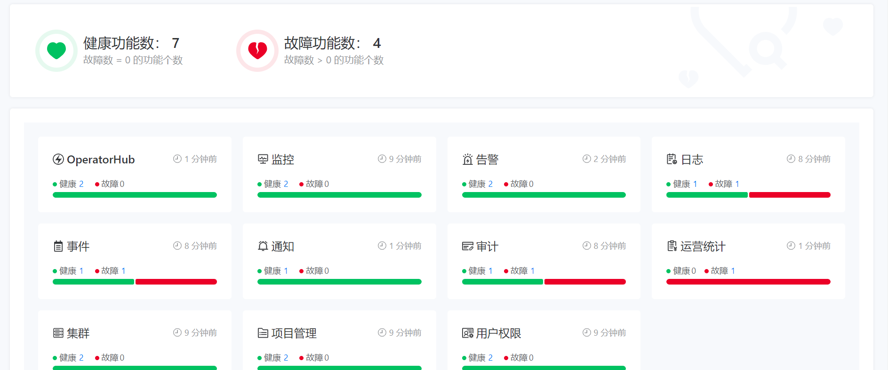
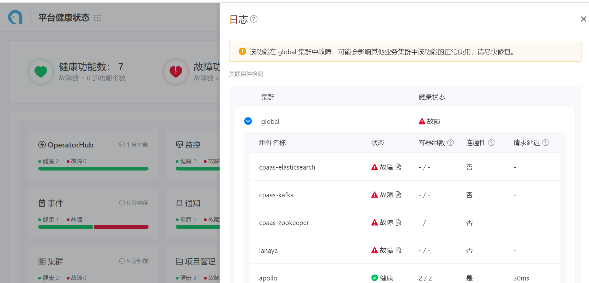

---
kind:
  - Troubleshooting
products:
  - Alauda Container Platform
  - Alauda DevOps
  - Alauda AI
  - Alauda Application Services
  - Alauda Service Mesh
  - Alauda Developer Portal
ProductsVersion:
  - 4.1.0,4.2.x
---
<!-- A type of document that involves encountering a fault, diagnosing it, performing root cause analysis, and providing solutions. -->

# 平台健康状况显示异常

平台健康状况提示为故障

## Cause
- 平台健康状态检查了已停用的global集群es相关组件

## Resolution
- 升级到3.13版本获得优化

## [workaround]
- 忽略该健康状态告警（不影响实际功能）

## [Related Information]
**Screenshots**

- Environment: 3.12.3
- es相关组件
- 日志插件
- 平台健康检查模块
- Component: (待归类)
- Page ID: 210438424
- Original Title: 基础架构-平台健康状况显示异常
