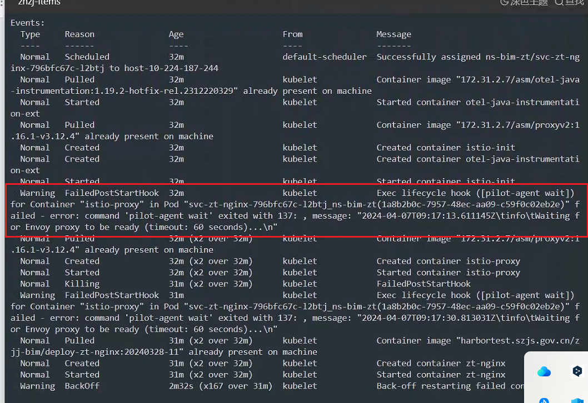

---
kind:
  - Troubleshooting
products:
  - Alauda Container Platform
  - Alauda DevOps
  - Alauda AI
  - Alauda Application Services
  - Alauda Service Mesh
  - Alauda Developer Portal
ProductsVersion:
  - 4.1.0,4.2.x
---
<!-- A type of document that involves encountering a fault, diagnosing it, performing root cause analysis, and providing solutions. -->

# 调用链导致业务异常

istio-proxy oom 业务服务健康检查失败 pod重启

## Cause
- sidecar默认配置0.1核cpu过低
- 信创cpu环境资源适配问题
- 网格内微服务数量与流量影响资源消耗

## Resolution
- 调整sidecar资源配置为0.2核256Mi

## [workaround]

## [Related Information]
**Screenshots**

- Environment: 3.12.0版本，信创cpu架构环境
- istio-proxy
- sidecar资源配置
- 健康检查机制
- 微服务网格
- Component: (待归类)
- Page ID: 210438468
- Original Title: 微服务-调用链导致业务异常
