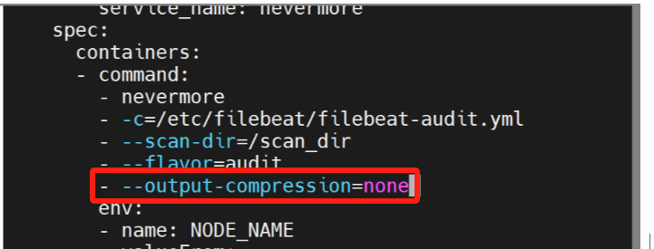

---
kind:
  - Troubleshooting
products:
  - Alauda Container Platform
  - Alauda DevOps
  - Alauda AI
  - Alauda Application Services
  - Alauda Service Mesh
  - Alauda Developer Portal
ProductsVersion:
  - 4.1.0,4.2.x
---
<!-- A type of document that involves encountering a fault, diagnosing it, performing root cause analysis, and providing solutions. -->

# 关闭nevermore日志采集压缩方法咨询

JIRA Jira：

## Cause

## Resolution
- 新增nevermore启动参数 --output-compression=none
- 通过平台界面更新DaemonSet资源
- 执行命令 kubectl edit DaemonSet -ncpaas-system nevermore 添加参数

## [workaround]

## [Related Information]
**Screenshots**

- Environment: 3.12, 3.14, 3.16
- DaemonSet
- ncpaas-system
- nevermore
- --output-compression
- Component: (待归类)
- Page ID: 214860230
- Original Title: 关闭nevermore日志采集压缩方法咨询
