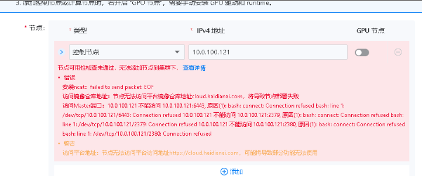

---
kind:
  - Troubleshooting
products:
  - Alauda Container Platform
  - Alauda DevOps
  - Alauda AI
  - Alauda Application Services
  - Alauda Service Mesh
  - Alauda Developer Portal
ProductsVersion:
  - 4.1.0,4.2.x
---
<!-- A type of document that involves encountering a fault, diagnosing it, performing root cause analysis, and providing solutions. -->

# 创建业务集群节点检查不通过

ncat安装失败 集群节点6443端口无法访问 手动拷贝速度较慢

## Cause
- 云上global集群与云下业务集群间网络带宽仅5Mbps
- 不符合部署要求的百兆带宽标准

## Resolution
- 将网络带宽升级至百兆以上

## [workaround]

## [Related Information]
**Screenshots**

- Environment: 云上global集群与云下业务集群混合部署环境
- ncat安装
- 6443端口
- global集群
- 业务集群
- Component: (待归类)
- Page ID: 229836457
- Original Title: 创建业务集群节点检查不通过-网络带宽不足导致
