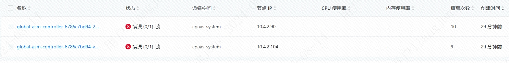
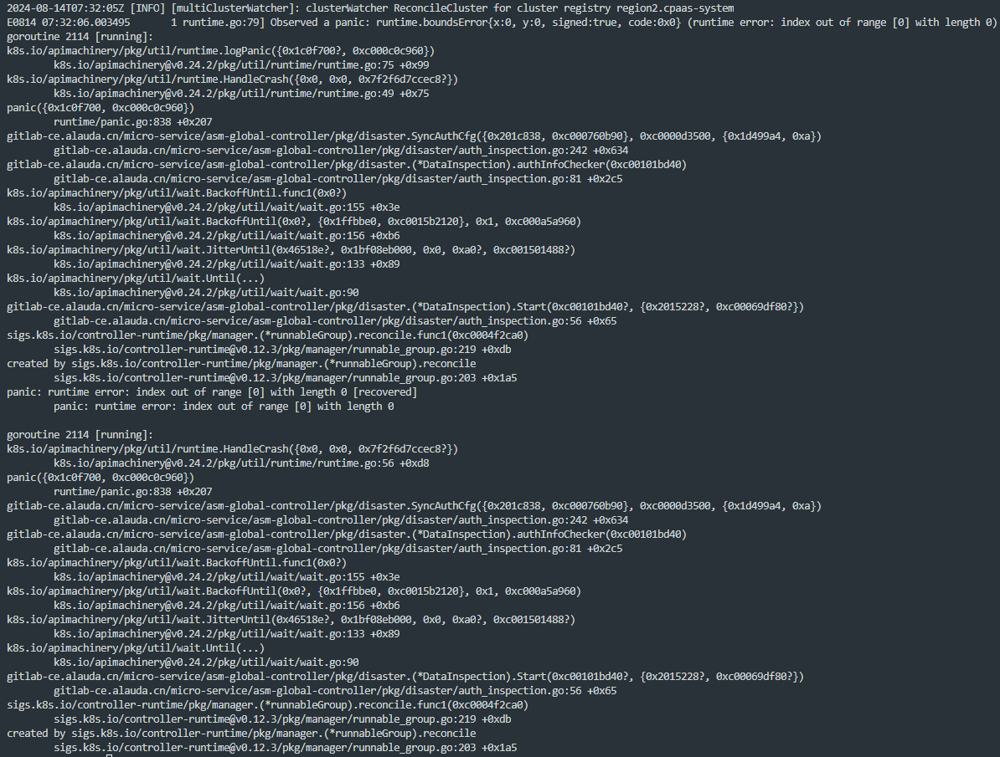
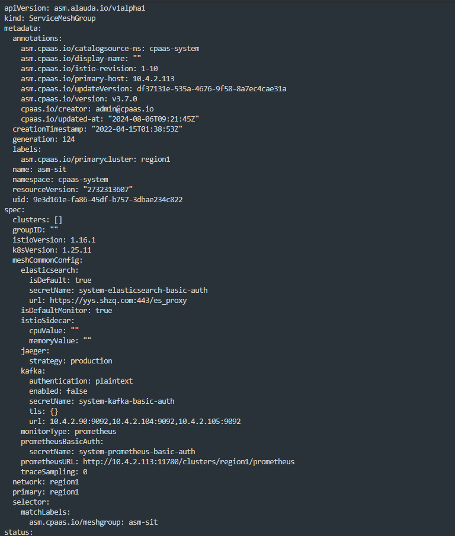

---
kind:
  - Troubleshooting
products:
  - Alauda Container Platform
  - Alauda DevOps
  - Alauda AI
  - Alauda Application Services
  - Alauda Service Mesh
  - Alauda Developer Portal
ProductsVersion:
  - 4.1.0,4.2.x
---
<!-- A type of document that involves encountering a fault, diagnosing it, performing root cause analysis, and providing solutions. -->

# v3.12

global-asm-controller pod启动失败 pod持续crash，日志报错panic

## Cause
- ServiceMeshGroup资源内cluster缺少集群名称字段

## Resolution
- 手动在ServiceMeshGroup资源内cluster处添加集群名称，重启global-asm-controller pod

## [workaround]

## [Related Information]
**Screenshots**

- Environment: 3.12.2
- ServiceMeshGroup
- global-asm-controller
- Component: (待归类)
- Page ID: 233866451
- Original Title: v3.12-微服务-global-asm-controller pod无法启动
