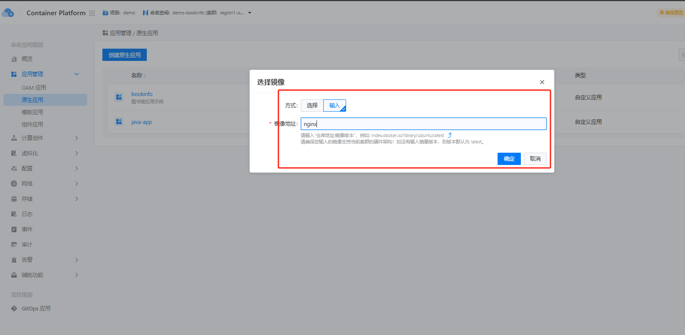
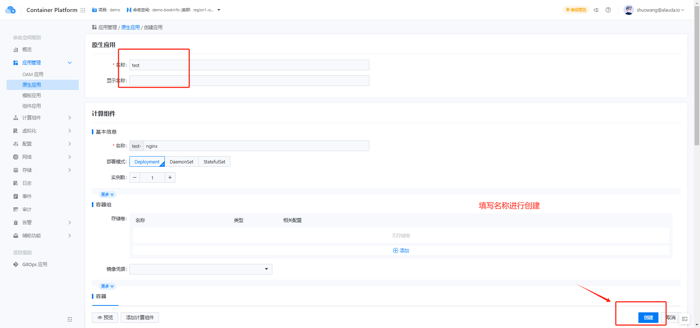
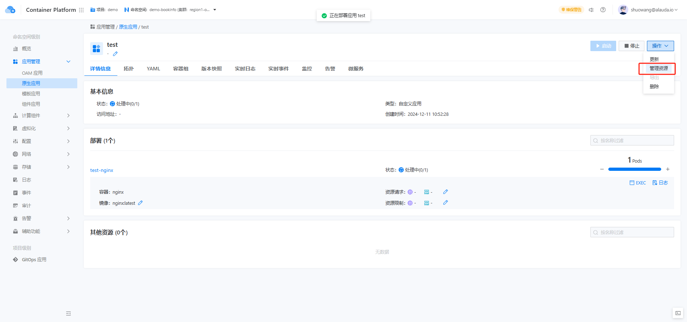
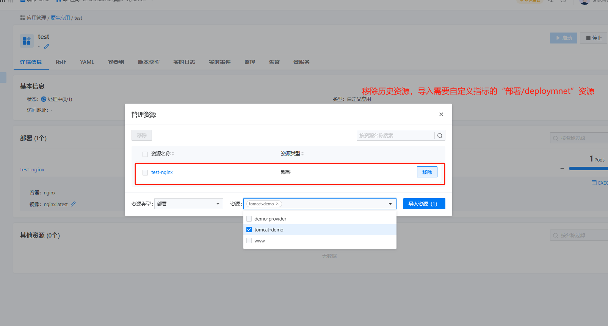
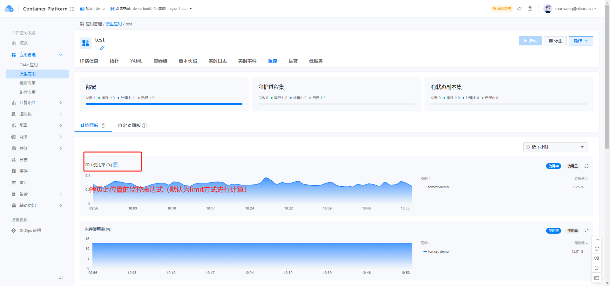
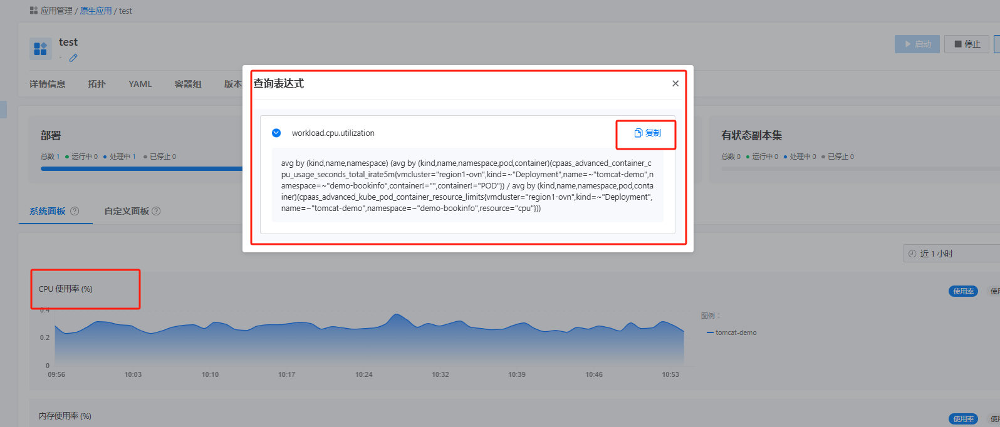
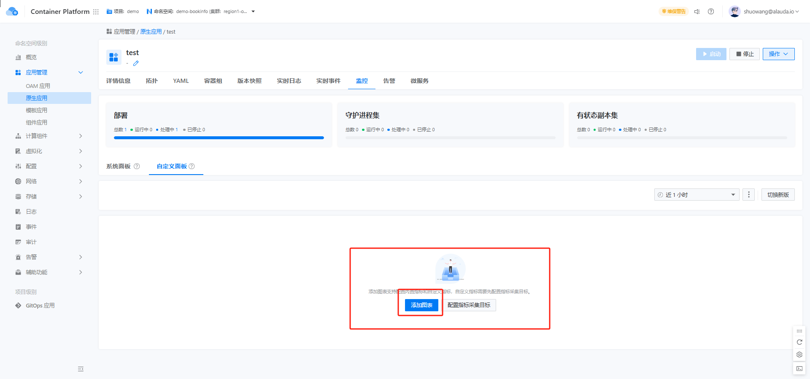
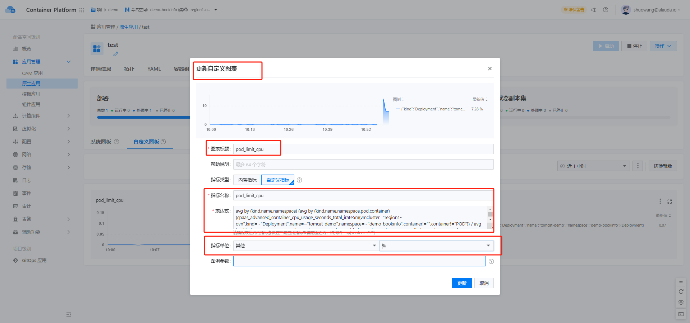
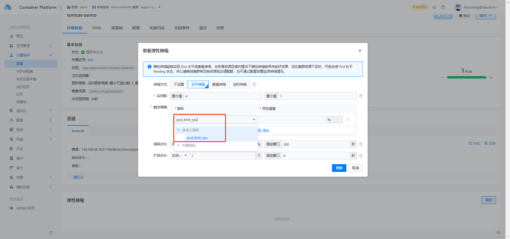

---
kind:
  - Troubleshooting
products:
  - Alauda Container Platform
  - Alauda DevOps
  - Alauda AI
  - Alauda Application Services
  - Alauda Service Mesh
  - Alauda Developer Portal
ProductsVersion:
  - 4.1.0,4.2.x
---
<!-- A type of document that involves encountering a fault, diagnosing it, performing root cause analysis, and providing solutions. -->

# 水平伸缩增加自定义指标

水平伸缩策略基于错误的资源使用数据触发伸缩

## Cause
- 默认CPU/内存指标基于pod requests配置计算，未考虑集群超售比设置

## Resolution
- 创建原生应用并通过资源管理踢出原有资源
- 导入包含自定义指标的deployment
- 在应用监控中拷贝CPU/内存监控表达式
- 创建自定义监控面板并配置弹性伸缩策略

## [workaround]

## [Related Information]
**Screenshots**

- Environment: Kubernetes 3.12及以上版本
- HPA
- Deployment
- 资源请求(request)配置
- 自定义监控面板
- Component: (待归类)
- Page ID: 251492113
- Original Title: 水平伸缩增加自定义指标
