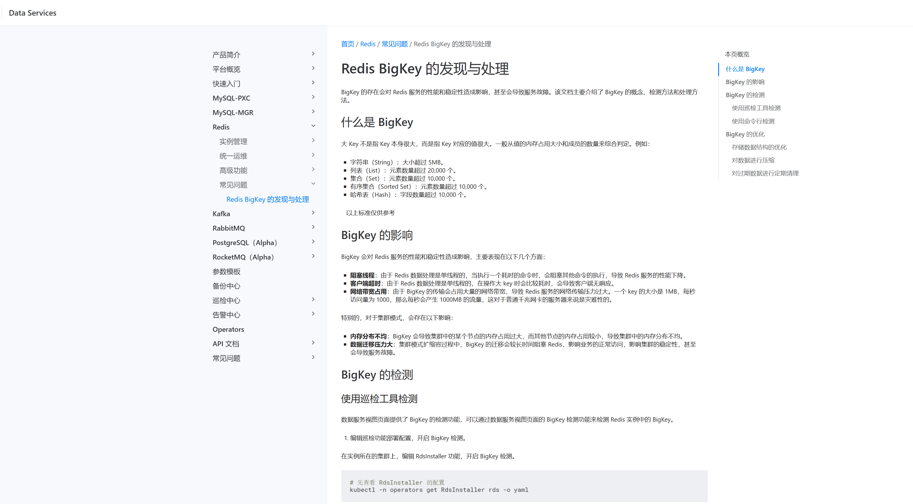

---
kind:
  - Troubleshooting
products:
  - Alauda Container Platform
  - Alauda DevOps
  - Alauda AI
  - Alauda Application Services
  - Alauda Service Mesh
  - Alauda Developer Portal
ProductsVersion:
  - 4.1.0,4.2.x
---
<!-- A type of document that involves encountering a fault, diagnosing it, performing root cause analysis, and providing solutions. -->

# big key优化

存在40MB大小的key

## Cause

## Resolution
- 按照《Bigkey 处理办法》文档处理

## [workaround]

## [Related Information]
**Screenshots**

- Environment: 适用版本：未知 | 关键词：dataservice, redis
- big key
- redis
- /console-dataservices-docs/zh/mw-u-redis/mw-faq/redis-big-key-check/
- Component: (待归类)
- Page ID: 268534609
- Original Title: 数据服务-big key优化
