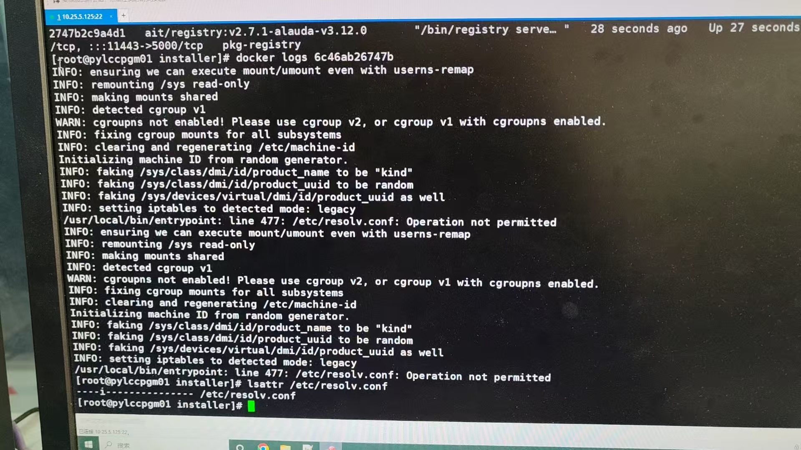

---
kind:
  - Troubleshooting
products:
  - Alauda Container Platform
  - Alauda DevOps
  - Alauda AI
  - Alauda Application Services
  - Alauda Service Mesh
  - Alauda Developer Portal
ProductsVersion:
  - 4.1.0,4.2.x
---
<!-- A type of document that involves encountering a fault, diagnosing it, performing root cause analysis, and providing solutions. -->

# 3.12.4安装平台setup.sh脚本报错

运行 bash setup.sh 时立即报错

## Cause
- /etc/resolv.conf 存在隐藏不可修改权限导致脚本检测失败

## Resolution
- 执行 chattr -i /etc/resolv.conf 移除隐藏权限
- 完成部署后恢复权限：chattr +i /etc/resolv.conf

## [workaround]

## [Related Information]
**Screenshots**

- Environment: 基础架构平台 3.12.4 版本
- /etc/resolv.conf
- setup.sh
- chattr
- Component: (待归类)
- Page ID: 268534622
- Original Title: 基础架构-3.12.4安装平台setup.sh脚本报错
