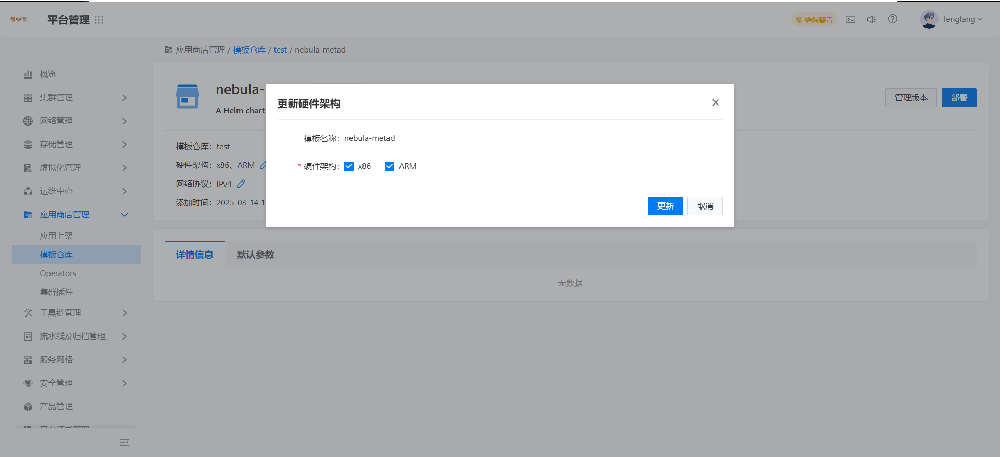
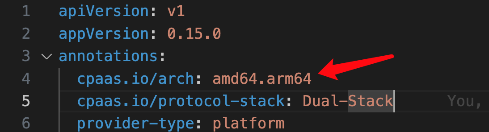

---
kind:
  - Troubleshooting
products:
  - Alauda Container Platform
  - Alauda DevOps
  - Alauda AI
  - Alauda Application Services
  - Alauda Service Mesh
  - Alauda Developer Portal
ProductsVersion:
  - 4.1.0,4.2.x
---
<!-- A type of document that involves encountering a fault, diagnosing it, performing root cause analysis, and providing solutions. -->

# arm集群模板仓库同步应用模板（chart）后应用市场不显示且部署无法选择对应版本

应用市场界面不显示同步的chart 部署模板无法选择对应版本

## Cause
- 未指定ARM硬件架构
- Chart.yaml缺少架构注解

## Resolution
- 在模板仓库配置中勾选ARM架构
- 在Chart.yaml添加注解：cpaas.io/arch: amd64.arm64并重新构建同步

## [workaround]

## [Related Information]
**Screenshots**

- Environment: arm集群
- Chart.yaml
- cpaas.io/arch
- 应用市场
- 模板仓库
- Component: (待归类)
- Page ID: 271025215
- Original Title: arm集群模板仓库同步应用模板（chart）后应用市场不显示且部署无法选择对应版本
