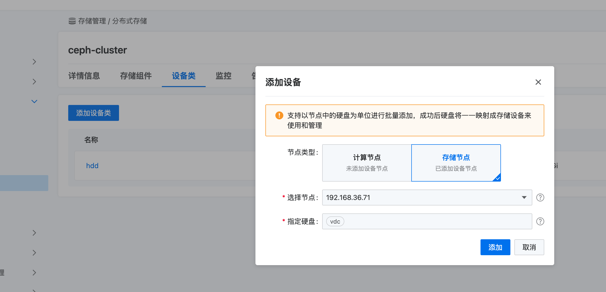

---
kind:
  - Troubleshooting
products:
  - Alauda Container Platform
  - Alauda DevOps
  - Alauda AI
  - Alauda Application Services
  - Alauda Service Mesh
  - Alauda Developer Portal
ProductsVersion:
  - 4.1.0,4.2.x
---
<!-- A type of document that involves encountering a fault, diagnosing it, performing root cause analysis, and providing solutions. -->

# 3.12.2ceph

数据均衡期间可能触发存储告警状态

## Cause
- 新增裸盘后触发数据重平衡过程

## Resolution
- 等待数据自动均衡完成

## [workaround]
- 如需回退需移除新增磁盘并再次完成数据均衡

## [Related Information]
**Screenshots**

- Environment: 3.12.2
- 存储节点
- 设备类
- 数据均衡
- Component: (待归类)
- Page ID: 274710621
- Original Title: 基础架构-3.12.2ceph-cluster扩容咨询-105133
