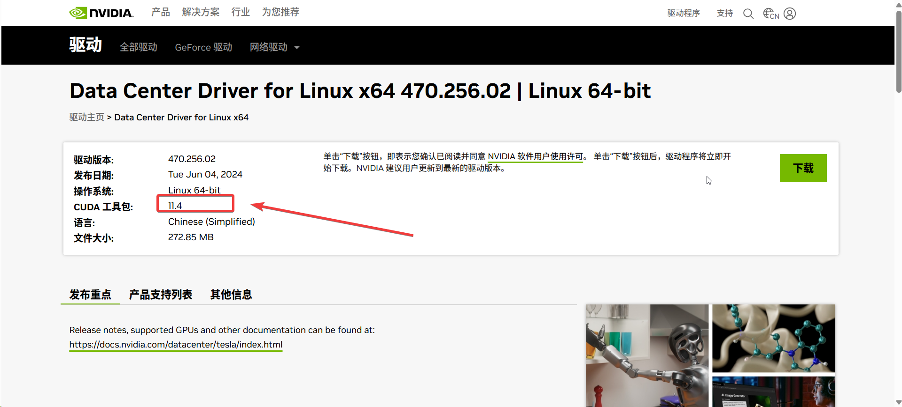

---
kind:
  - Troubleshooting
products:
  - Alauda Container Platform
  - Alauda DevOps
  - Alauda AI
  - Alauda Application Services
  - Alauda Service Mesh
  - Alauda Developer Portal
ProductsVersion:
  - 4.1.0,4.2.x
---
<!-- A type of document that involves encountering a fault, diagnosing it, performing root cause analysis, and providing solutions. -->

# GPU节点部署问题

cpaas-monitor-exporter-gpu pod启动异常 global集群获取gpu-manager版本信息为空 业务集群已开启虚拟GPU

## Cause
- 客户安装的CUDA版本(12.2)与gpu-manager支持的CUDA版本(11.4)不适配

## Resolution
- 重新安装nvidia驱动，更换适配版本为535.54.03（对应CUDA 11.4）

## [workaround]

## [Related Information]
**Screenshots**

- Environment: 3.14.2
- cpaas-monitor-exporter-gpu
- gpu-manager
- CUDA 11.4
- nvidia-driver-535.54.03
- Component: (待归类)
- Page ID: 277807297
- Original Title: 微服务-AI-GPU节点部署问题-105211
