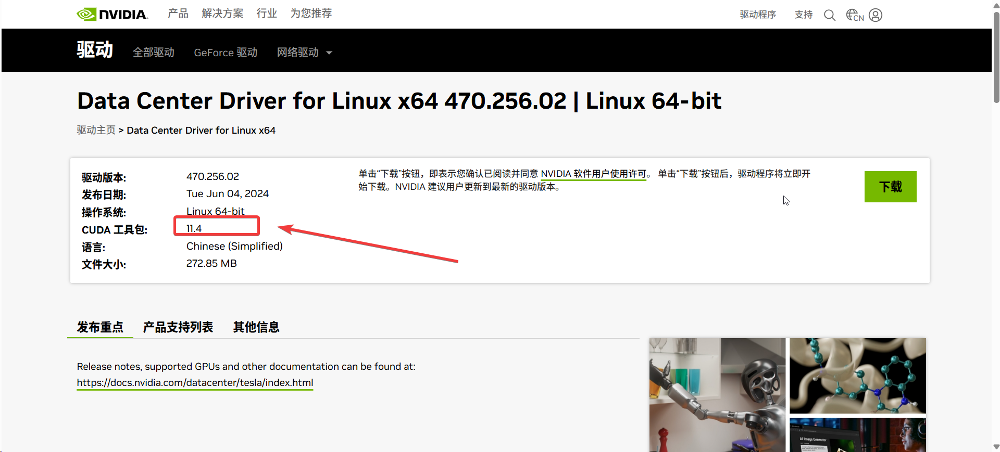

---
kind:
  - Troubleshooting
products:
  - Alauda Container Platform
  - Alauda DevOps
  - Alauda AI
  - Alauda Application Services
  - Alauda Service Mesh
  - Alauda Developer Portal
ProductsVersion:
  - 4.1.0,4.2.x
---
<!-- A type of document that involves encountering a fault, diagnosing it, performing root cause analysis, and providing solutions. -->

# GPU 底层插件排查逻辑文档

cpaas-monitor-exporter-gpu pod启动异常 global集群获取gpu-manager版本信息为空

## Cause
- CUDA 12.2版本与gpu-manager支持的CUDA 11.4版本不兼容

## Resolution
- 重新安装nvidia驱动，更换适配版本（推荐版本见原始文档图片）

## [workaround]

## [Related Information]
**Screenshots**

- Environment: ACP 3.14版本，已开启虚拟GPU
- cpaas-monitor-exporter-gpu
- gpu-manager
- CUDA版本
- nvidia驱动
- Component: (待归类)
- Page ID: 277807412
- Original Title: GPU 底层插件排查逻辑文档 --- 编辑中
