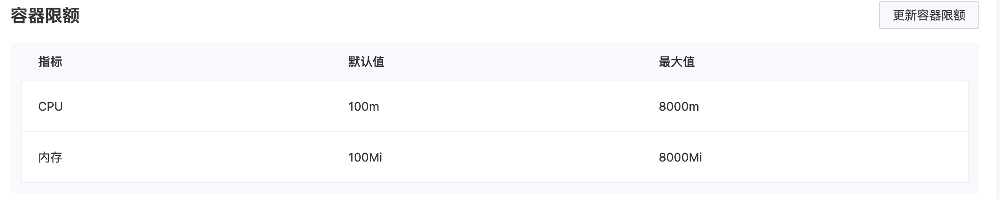
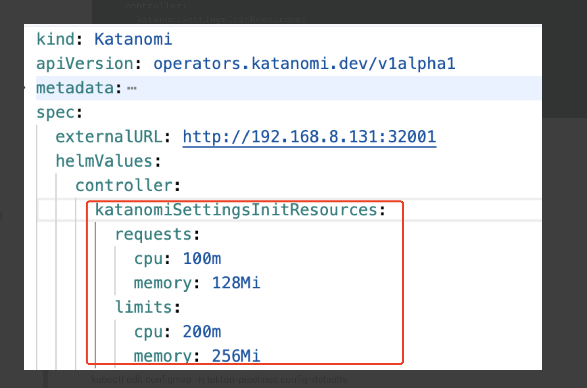
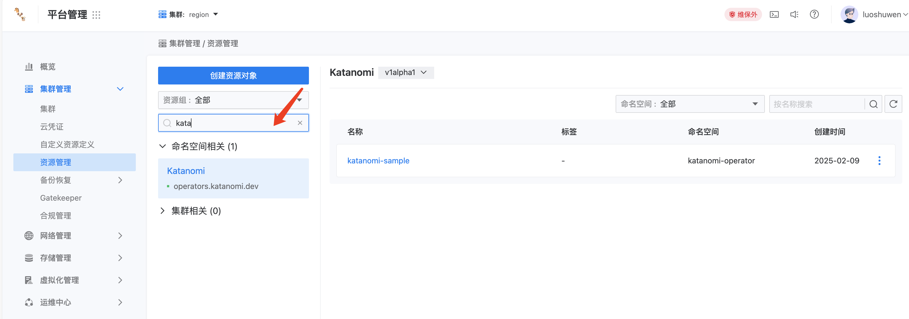

---
kind:
  - Troubleshooting
products:
  - Alauda Container Platform
  - Alauda DevOps
  - Alauda AI
  - Alauda Application Services
  - Alauda Service Mesh
  - Alauda Developer Portal
ProductsVersion:
  - 4.1.0,4.2.x
---
<!-- A type of document that involves encountering a fault, diagnosing it, performing root cause analysis, and providing solutions. -->

# katanomi

katanomi-init pod 发生了 OOM（内存不足）错误，导致容器被终止

## Cause
- 内存限制配置不合理
- 存在内存泄漏或异常高内存消耗

## Resolution
- 调整 katanomi-init pod 的内存限制
- 优化容器的内存使用
- 监控调整后的内存使用情况

## [workaround]

## [Related Information]
**Screenshots**

- Environment: v3.12.4
- katanomi-init pod
- 内存资源限制配置
- 内存使用监控
- Component: (待归类)
- Page ID: 310085349
- Original Title: Devops-katanomi-init pod oom-111745-zh
