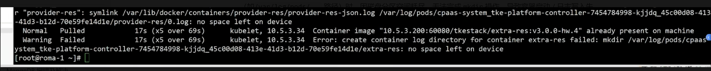

---
kind:
  - Troubleshooting
products:
  - Alauda Container Platform
  - Alauda DevOps
  - Alauda AI
  - Alauda Application Services
  - Alauda Service Mesh
  - Alauda Developer Portal
ProductsVersion:
  - 4.1.0,4.2.x
---
<!-- A type of document that involves encountering a fault, diagnosing it, performing root cause analysis, and providing solutions. -->

# 容器平台,产品组件

容器无法正常启动 容器尝试创建文件失败

## Cause
- 节点/var/log目录存储空间使用率达到100%

## Resolution
- 清理节点/var/log目录下的日志文件释放存储空间

## [workaround]

## [Related Information]
**Screenshots**

- Environment: v3.12.1-rc.2
- /var/log/pods/
- df -h
- fluentd
- log-agent
- Component: (待归类)
- Page ID: 311034140
- Original Title: 容器平台,产品组件-容器起不来-底层存储导致-112048-zh
