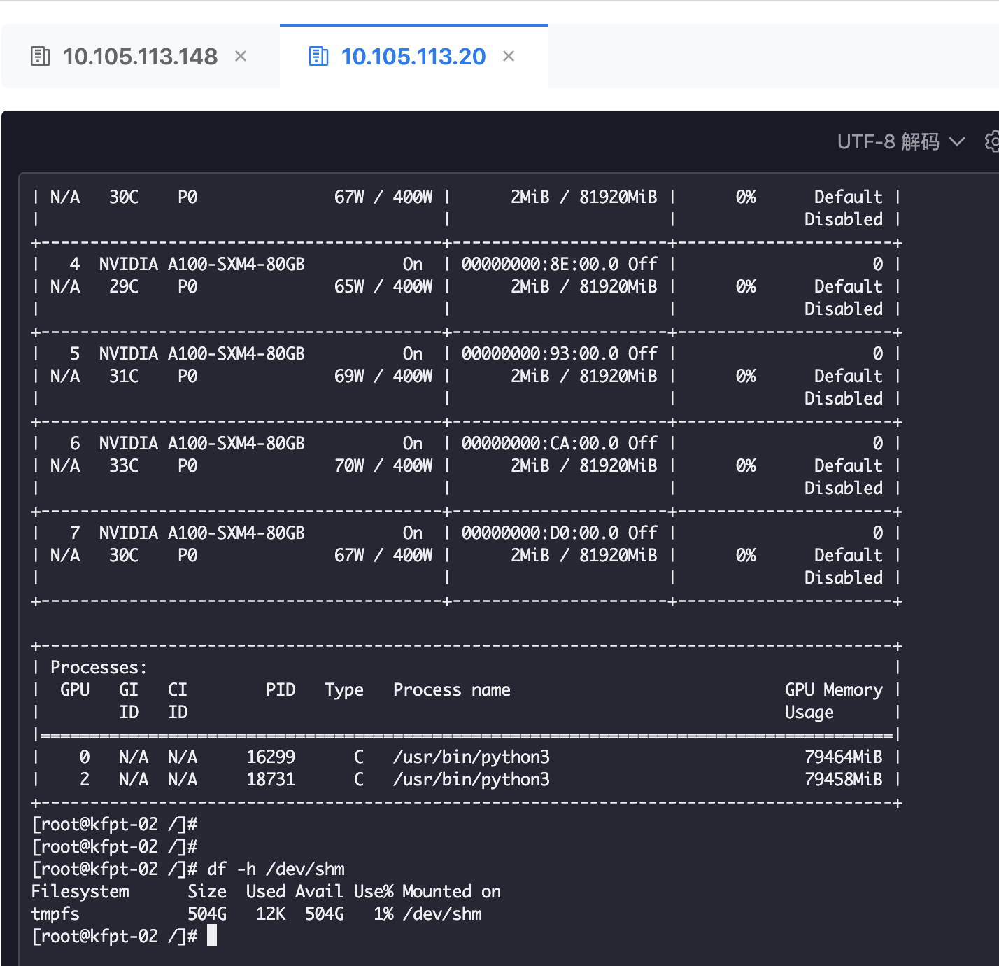

---
kind:
  - Troubleshooting
products:
  - Alauda Container Platform
  - Alauda DevOps
  - Alauda AI
  - Alauda Application Services
  - Alauda Service Mesh
  - Alauda Developer Portal
ProductsVersion:
  - 4.1.0,4.2.x
---
<!-- A type of document that involves encountering a fault, diagnosing it, performing root cause analysis, and providing solutions. -->

# qwen3

相同yaml配置重新部署qwen3-32b模型报错 调整--gpu-memory-utilization=0.99仍无法启动 修改--max-model-len=4096仍无法启动

## Cause
- 新节点GPU内存资源不足导致32B模型启动失败

## Resolution
- 改用235B模型并设置gpu-memory-utilization=0.85后正常启动

## [workaround]

## [Related Information]
**Screenshots**

- Environment: 3.18.1
- --gpu-memory-utilization
- --max-model-len
- nvidia-smi
- /dev/shm
- Component: (待归类)
- Page ID: 321043584
- Original Title: 微服务-AI-qwen3-32b相同yaml配置重新部署，但总报错，原来推理服务正常-113380
