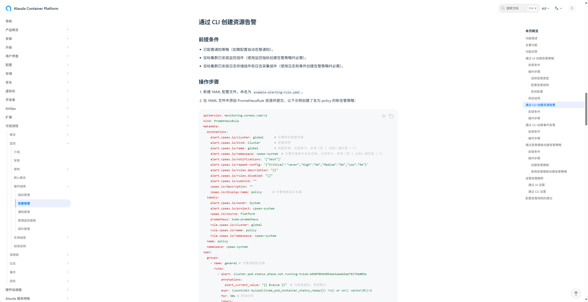

---
kind:
  - Troubleshooting
products:
  - Alauda Container Platform
  - Alauda DevOps
  - Alauda AI
  - Alauda Application Services
  - Alauda Service Mesh
  - Alauda Developer Portal
ProductsVersion:
  - 4.1.0,4.2.x
---
<!-- A type of document that involves encountering a fault, diagnosing it, performing root cause analysis, and providing solutions. -->

# 测试集群手动创建了一个prometheusrule，界面上不显示

手动创建的PrometheusRule在界面上不显示

## Cause

## Resolution
- 通过CLI创建告警策略

## [workaround]

## [Related Information]
**Screenshots**

- Environment: 4.0.2
- cli
- Component: (待归类)
- Page ID: 321043615
- Original Title: 基础架构-测试集群手动创建了一个prometheusrule，界面上不显示-113341
