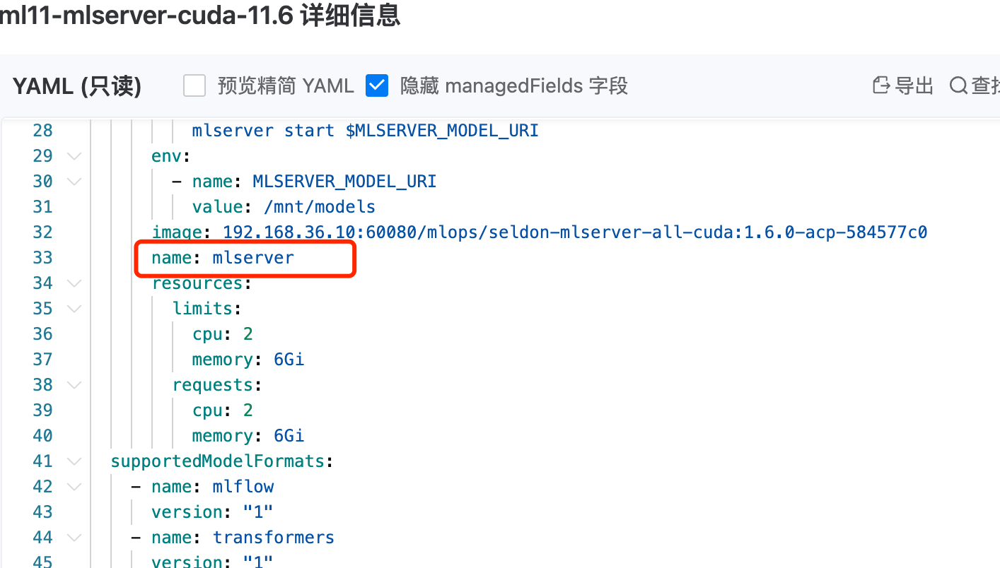

---
kind:
  - Troubleshooting
products:
  - Alauda Container Platform
  - Alauda DevOps
  - Alauda AI
  - Alauda Application Services
  - Alauda Service Mesh
  - Alauda Developer Portal
ProductsVersion:
  - 4.1.0,4.2.x
---
<!-- A type of document that involves encountering a fault, diagnosing it, performing root cause analysis, and providing solutions. -->

# demo环境部署推理服务失败

failed to find kserve-container in ServingRuntime containers

## Cause
- ClusterServingRuntime aml-mlserver-cuda-11.6 资源名称配置错误

## Resolution
- 从其他环境拷贝新的 aml-mlserver-cuda-11.6 资源并重新部署

## [workaround]

## [Related Information]
**Screenshots**

- Environment: 4.0.0
- ClusterServingRuntime
- aml-mlserver-cuda-11.6
- Component: (待归类)
- Page ID: 323682807
- Original Title: 微服务-AI-demo环境部署推理服务失败-113689
