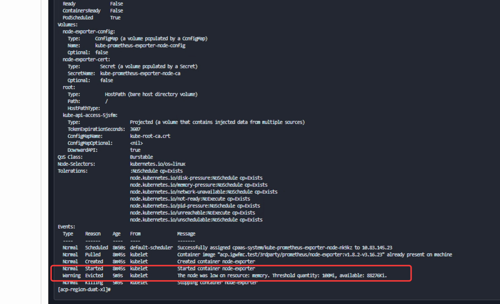

---
kind:
  - Troubleshooting
products:
  - Alauda Container Platform
  - Alauda DevOps
  - Alauda AI
  - Alauda Application Services
  - Alauda Service Mesh
  - Alauda Developer Portal
ProductsVersion:
  - 4.1.0,4.2.x
---
<!-- A type of document that involves encountering a fault, diagnosing it, performing root cause analysis, and providing solutions. -->

# 很多集群的告警

集群23节点内存资源不足告警

## Cause
- 节点内存资源不足

## Resolution
- 增加节点内存

## [workaround]

## [Related Information]
**Screenshots**

- Environment: 3.16.2
- Component: (待归类)
- Page ID: 324173957
- Original Title: 基础架构-很多集群的告警-113854
