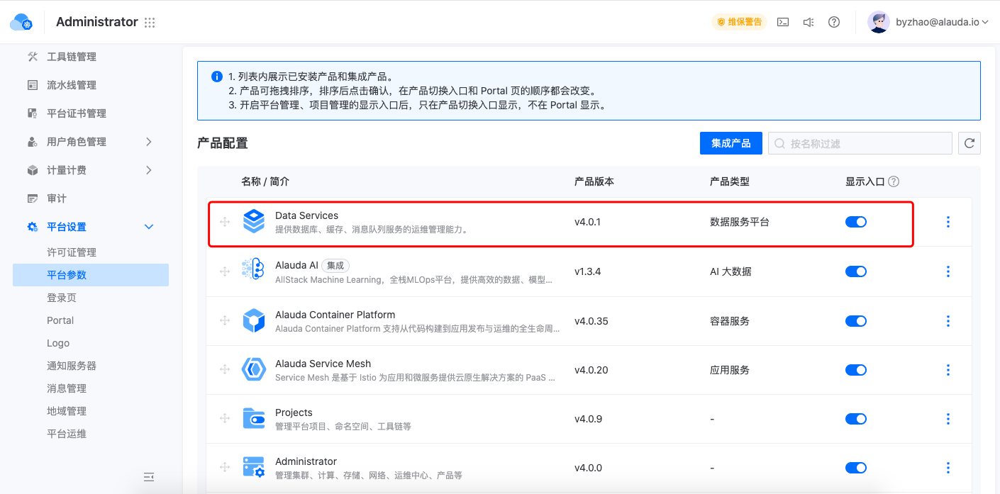

---
kind:
  - Troubleshooting
products:
  - Alauda Container Platform
  - Alauda DevOps
  - Alauda AI
  - Alauda Application Services
  - Alauda Service Mesh
  - Alauda Developer Portal
ProductsVersion:
  - 4.1.0,4.2.x
---
<!-- A type of document that involves encountering a fault, diagnosing it, performing root cause analysis, and providing solutions. -->

# portal页无法显示数据服务产品卡片

portal页无法显示数据服务产品卡片

## Cause
- 属于产品预期行为

## Resolution
- 无需修复，属于产品设计行为

## [workaround]

## [Related Information]
**Screenshots**

- Environment: 4.0.0
- portal
- Component: (待归类)
- Page ID: 324173966
- Original Title: 容器平台-portal页无法显示数据服务产品卡片-113500
