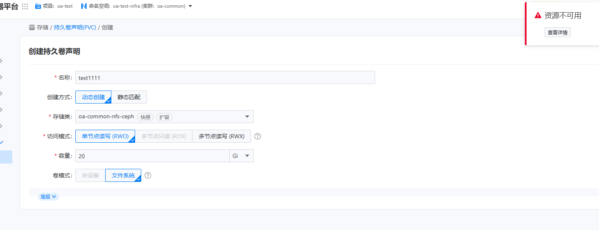
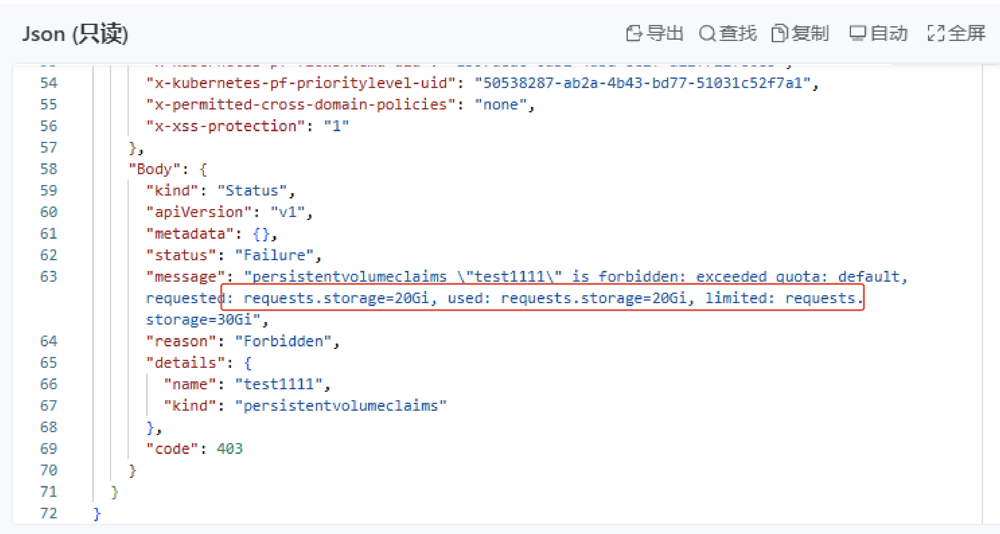

---
kind:
  - Troubleshooting
products:
  - Alauda Container Platform
  - Alauda DevOps
  - Alauda AI
  - Alauda Application Services
  - Alauda Service Mesh
  - Alauda Developer Portal
ProductsVersion:
  - 4.1.0,4.2.x
---
<!-- A type of document that involves encountering a fault, diagnosing it, performing root cause analysis, and providing solutions. -->

# pvc创建失败

pvc创建失败

## Cause
- 命名空间存储资源配额限制(30G)已使用20G，申请20G时超出剩余配额

## Resolution
- 将pvc存储申请配额从20G调整为10G

## [workaround]

## [Related Information]
**Screenshots**

- Environment: 3.18.1
- ResourceQuota
- PersistentVolumeClaim.spec.resources.requests.storage
- 命名空间
- Component: (待归类)
- Page ID: 324173975
- Original Title: pvc创建失败
