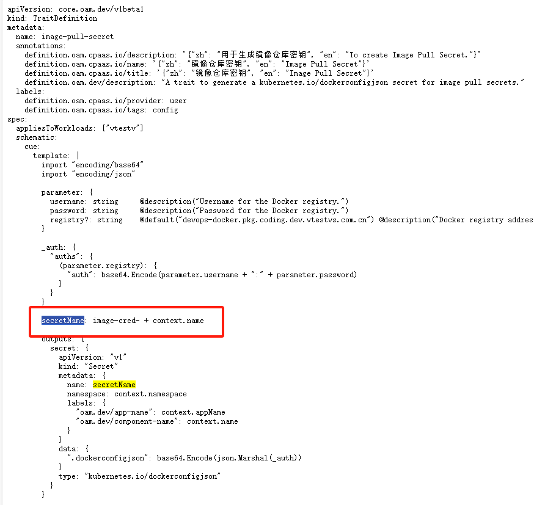

---
kind:
  - Troubleshooting
products:
  - Alauda Container Platform
  - Alauda DevOps
  - Alauda AI
  - Alauda Application Services
  - Alauda Service Mesh
  - Alauda Developer Portal
ProductsVersion:
  - 4.1.0,4.2.x
---
<!-- A type of document that involves encountering a fault, diagnosing it, performing root cause analysis, and providing solutions. -->

# oam界面显示异常

oam界面string数组无法显示 trait参数无法显示

## Cause
- secretName定义使用了错误的yaml语法：secretName: "image-cred-" + context.name
- parameter定义格式错误：parameter:{a: string}缺少空格

## Resolution
- 修改secretName定义为：secretName: "image-cred-" + context.name
- 修正parameter格式为：parameter: {a: string}

## [workaround]

## [Related Information]
**Screenshots**

- Environment: 4.0.2
- secretName
- parameter语法
- OAM模板
- Component: (待归类)
- Page ID: 324174031
- Original Title: 容器平台-应用管理-OAM应用-oam界面显示异常-113791
