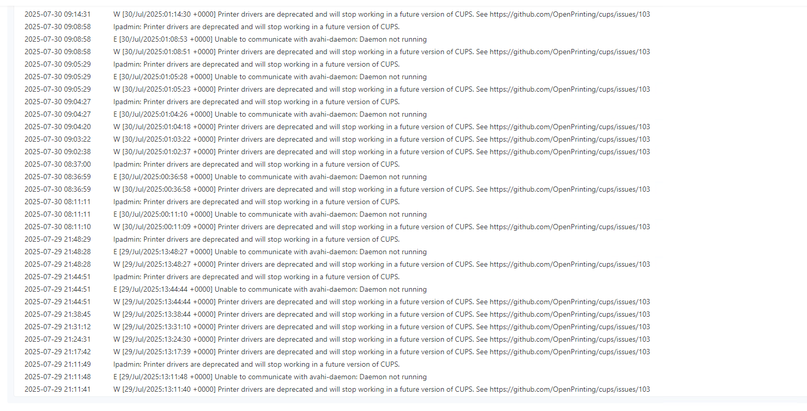
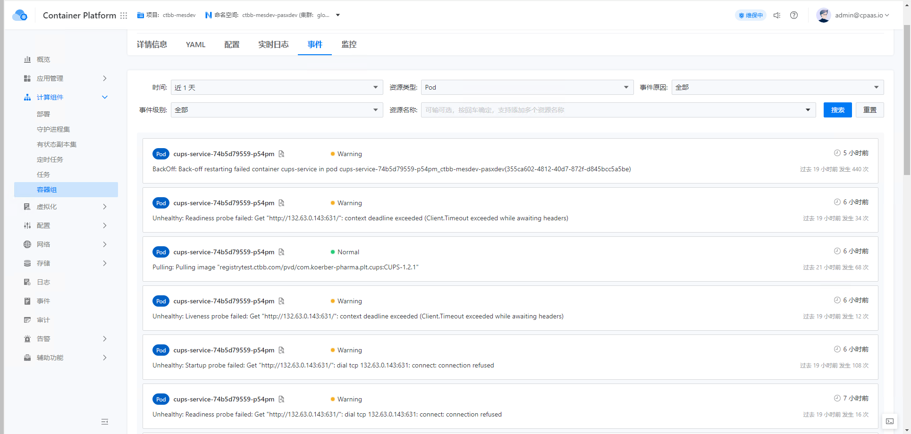

---
kind:
  - Troubleshooting
products:
  - Alauda Container Platform
  - Alauda DevOps
  - Alauda AI
  - Alauda Application Services
  - Alauda Service Mesh
  - Alauda Developer Portal
ProductsVersion:
  - 4.1.0,4.2.x
---
<!-- A type of document that involves encountering a fault, diagnosing it, performing root cause analysis, and providing solutions. -->

# POD频繁BackOff

Pod频繁BackOff 健康检查失败

## Cause
- avahi-daemon服务未启动

## Resolution
- 启动avahi-daemon服务
- 确保avahi-daemon服务正常运行

## [workaround]

## [Related Information]
**Screenshots**

- Environment: 3.16.1
- avahi-daemon
- 健康检查配置
- cups-service容器
- Component: (待归类)
- Page ID: 324174204
- Original Title: 容器平台-POD频繁BackOff-114103
