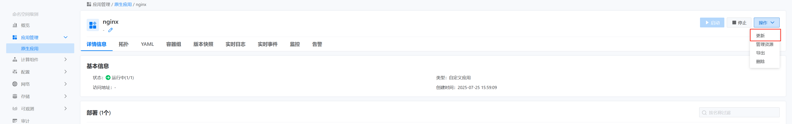
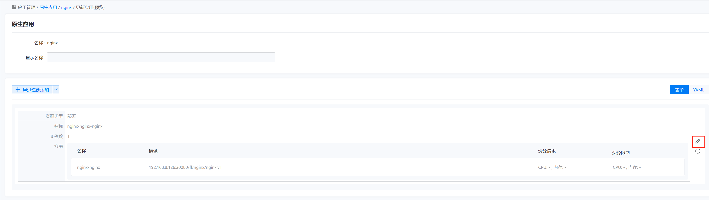
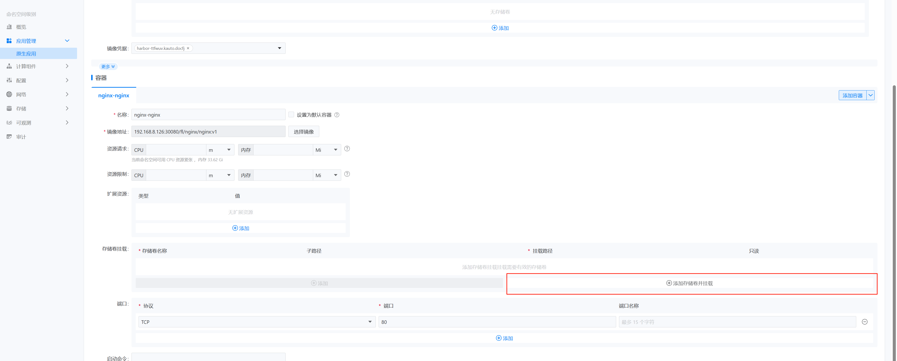

---
kind:
  - Troubleshooting
products:
  - Alauda Container Platform
  - Alauda DevOps
  - Alauda AI
  - Alauda Application Services
  - Alauda Service Mesh
  - Alauda Developer Portal
ProductsVersion:
  - 4.1.0,4.2.x
---
<!-- A type of document that involves encountering a fault, diagnosing it, performing root cause analysis, and providing solutions. -->

# 配置JDBC日志目录，需协助容器如何需要挂载paas云里面创建的卷

JIRA Jira：

## Cause

## Resolution
- 更新原生应用并挂载存储卷

## [workaround]

## [Related Information]
**Screenshots**

- Environment: 3.12.1
- region集群组件
- global集群组件
- Component: (待归类)
- Page ID: 324174213
- Original Title: 容器平台-配置JDBC日志目录，需协助容器如何需要挂载paas云里面创建的卷-113773
