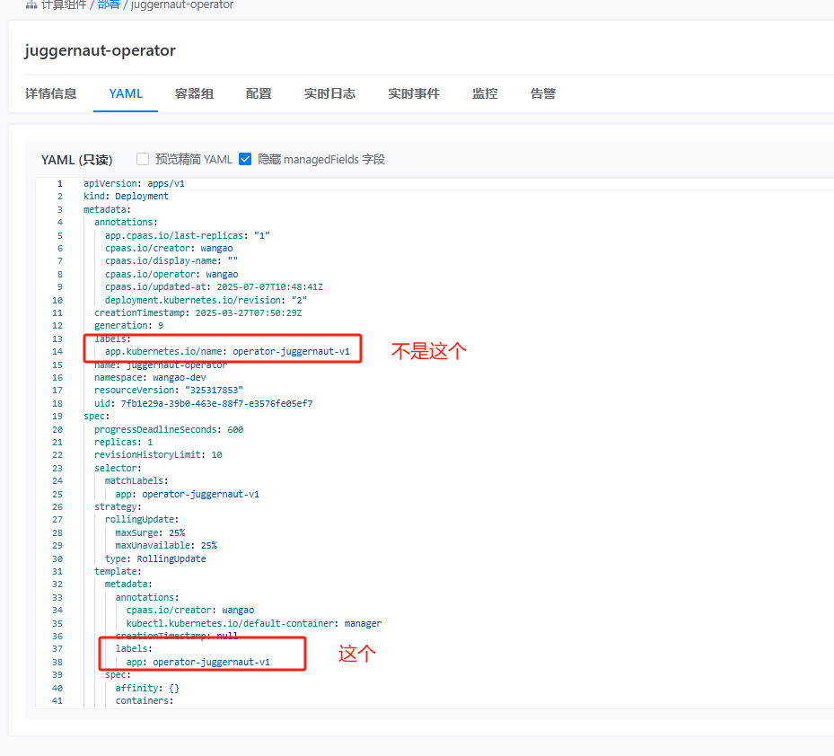

---
kind:
  - Troubleshooting
products:
  - Alauda Container Platform
  - Alauda DevOps
  - Alauda AI
  - Alauda Application Services
  - Alauda Service Mesh
  - Alauda Developer Portal
ProductsVersion:
  - 4.1.0,4.2.x
---
<!-- A type of document that involves encountering a fault, diagnosing it, performing root cause analysis, and providing solutions. -->

# 内部路由通过标签选择，无法匹配上已打上标签的后端

无法匹配上已打上标签的后端Pod

## Cause
- Service配置使用了Deployment层级的标签而非Pod模板(template)层级的标签

## Resolution
- 检查并修改Service的selector配置，使其匹配Deployment中spec.template.metadata.labels定义的标签

## [workaround]

## [Related Information]
**Screenshots**

- Environment: 3.12.2
- service.spec.selector
- deployment.spec.template.metadata.labels
- Component: (待归类)
- Page ID: 324174428
- Original Title: 容器平台-内部路由通过标签选择，无法匹配上已打上标签的后端-112459
