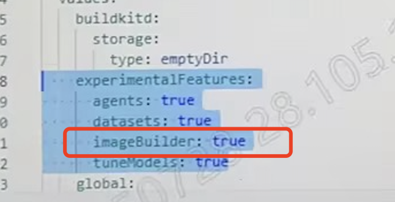

---
kind:
  - Troubleshooting
products:
  - Alauda Container Platform
  - Alauda DevOps
  - Alauda AI
  - Alauda Application Services
  - Alauda Service Mesh
  - Alauda Developer Portal
ProductsVersion:
  - 4.1.0,4.2.x
---
<!-- A type of document that involves encountering a fault, diagnosing it, performing root cause analysis, and providing solutions. -->

# AML 界面无数据集菜单

AML 界面看不到数据集菜单

## Cause
- 资源配置未正确配置微调和预训练相关组件

## Resolution
- 调整资源配置，仅保留微调和预训练所需组件

## [workaround]

## [Related Information]
**Screenshots**

- Environment: 4.0.1
- 微调
- 预训练
- 资源管理
- Component: (待归类)
- Page ID: 324174440
- Original Title: 微服务-AI-AML 界面无数据集菜单-113965
