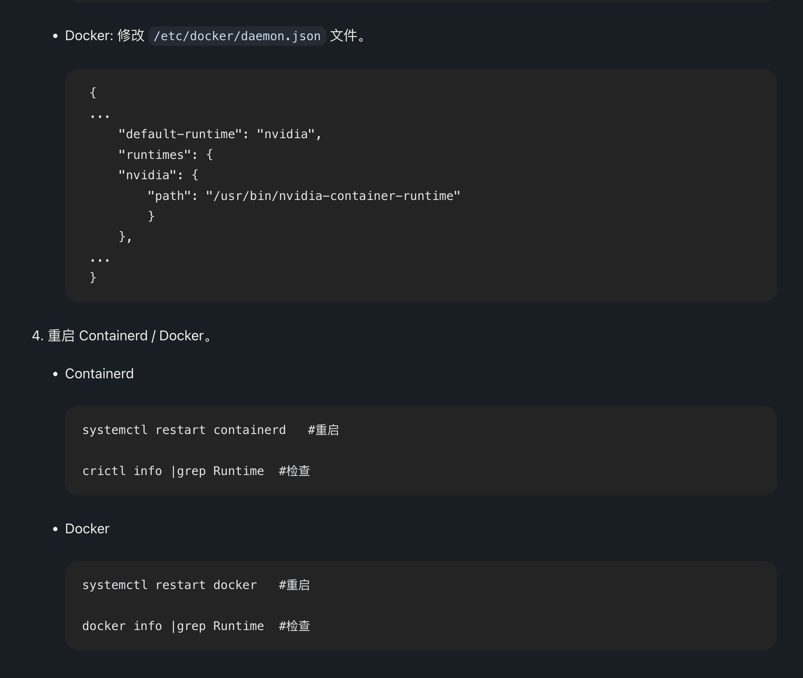

---
kind:
  - Troubleshooting
products:
  - Alauda Container Platform
  - Alauda DevOps
  - Alauda AI
  - Alauda Application Services
  - Alauda Service Mesh
  - Alauda Developer Portal
ProductsVersion:
  - 4.1.0,4.2.x
---
<!-- A type of document that involves encountering a fault, diagnosing it, performing root cause analysis, and providing solutions. -->

# 生产环境hami插件异常

无法部署GPU服务

## Cause
- 新增GPU节点后未初始化
- 未将default runtime设置为nvidia

## Resolution
- 初始化新增GPU节点
- 在docker配置中设置"default-runtime": "nvidia"

## [workaround]

## [Related Information]
**Screenshots**

- Environment: 3.18.1
- default runtime配置
- /etc/docker/daemon.json
- nvidia-container-runtime
- GPU节点初始化
- Component: (待归类)
- Page ID: 327268268
- Original Title: 微服务-AI-生产环境hami插件异常-112978
