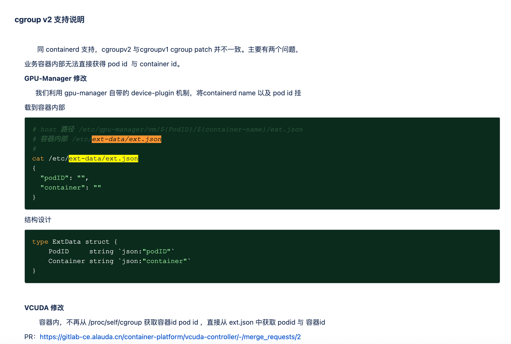

---
kind:
  - Troubleshooting
products:
  - Alauda Container Platform
  - Alauda DevOps
  - Alauda AI
  - Alauda Application Services
  - Alauda Service Mesh
  - Alauda Developer Portal
ProductsVersion:
  - 4.1.0,4.2.x
---
<!-- A type of document that involves encountering a fault, diagnosing it, performing root cause analysis, and providing solutions. -->

# GPU使用问题

容器内运行nvidia-smi pmon -s u -d 1无数据 GPU使用率监控显示83%但limit为50（1个物理核心的50%） 显存监控显示6G但limit为4u（1G）

## Cause
- Ubuntu 2204使用cgroup v2导致gpu-manager不兼容

## Resolution
- 使用hami的vgpu方案替代gpu-manager

## [workaround]

## [Related Information]
**Screenshots**

- Environment: 3.18.1, Ubuntu 2204
- nvidia-smi pmon -s u -d 1
- tencent.com/vcuda-core
- tencent.com/vcuda-memory
- ext.json
- gpu-manager
- hami vgpu
- Component: (待归类)
- Page ID: 327268740
- Original Title: 微服务-AI-GPU使用问题-112807
