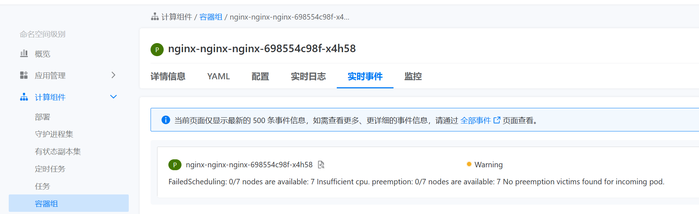
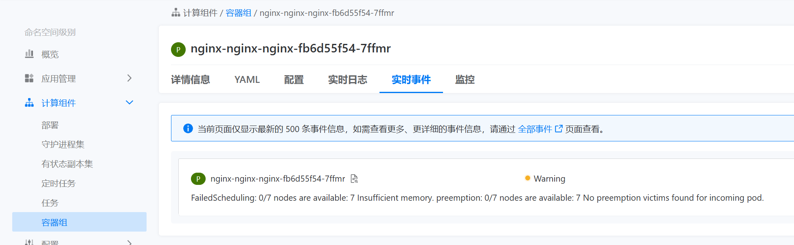
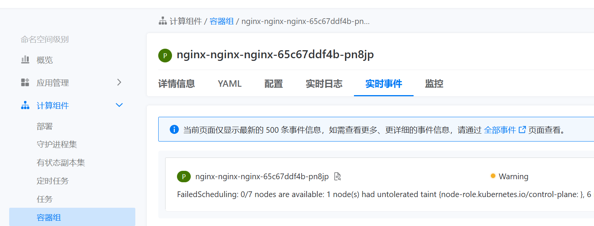
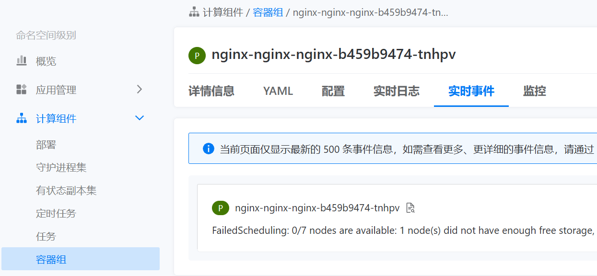
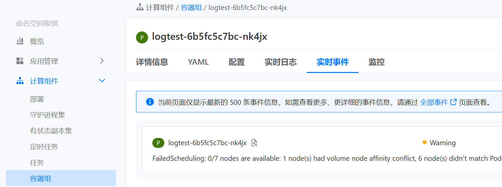

---
kind:
  - Troubleshooting
products:
  - Alauda Container Platform
  - Alauda DevOps
  - Alauda AI
  - Alauda Application Services
  - Alauda Service Mesh
  - Alauda Developer Portal
ProductsVersion:
  - 4.1.0,4.2.x
---
<!-- A type of document that involves encountering a fault, diagnosing it, performing root cause analysis, and providing solutions. -->

# 常见pending状态汇总

Pod因CPU资源不足无法调度 Pod因内存资源不足无法调度 Pod因节点存在污点无法调度

## Cause
- 节点CPU资源不足
- 节点内存资源不足
- 节点存在未容忍的污点
- 节点存储资源不足或节点选择器配置问题
- 节点选择器与PV所在节点不一致

## Resolution
- 调小cpu request/调度至其他节点/迁移高cpu应用/节点扩容
- 调小内存request/调度至其他节点/迁移高内存应用/节点扩容
- 取消污点/配置容忍/调度至其他节点
- 更换存储充足节点/扩容存储/调整节点选择器
- 调整节点选择器以匹配PV所在节点

## [workaround]

## [Related Information]
**Screenshots**

- Environment: 通用版本
- cpu request
- 内存 request
- 污点(Taints)
- 节点选择器(nodeSelector)
- PVC
- PV
- 卷节点亲和性
- Component: (待归类)
- Page ID: 327285022
- Original Title: 常见pending状态汇总
