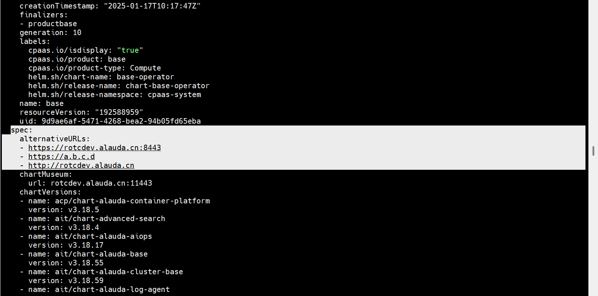

---
kind:
  - Troubleshooting
products:
  - Alauda Container Platform
  - Alauda DevOps
  - Alauda AI
  - Alauda Application Services
  - Alauda Service Mesh
  - Alauda Developer Portal
ProductsVersion:
  - 4.1.0,4.2.x
---
<!-- A type of document that involves encountering a fault, diagnosing it, performing root cause analysis, and providing solutions. -->

# 登录，授权码不合法

授权码不合法 重启apollo组件后问题依旧

## Cause
- 部署平台时未正确配置客户开通的映射地址

## Resolution
- 修改global集群prdb base的yaml文件，添加平台其他访问地址

## [workaround]

## [Related Information]
**Screenshots**

- Environment: 4.0.3
- prdb base.yaml
- apollo组件
- global集群
- Component: (待归类)
- Page ID: 327811939
- Original Title: 基础架构-登录，授权码不合法-112972
