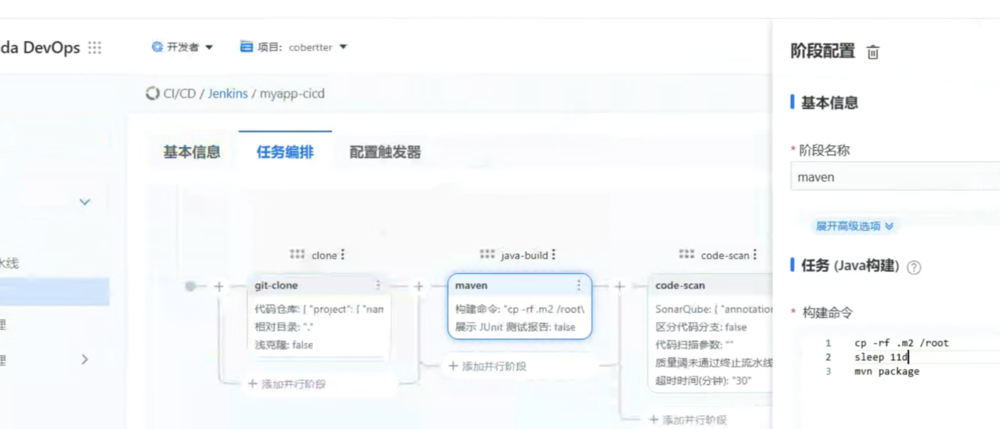

---
kind:
  - Troubleshooting
products:
  - Alauda Container Platform
  - Alauda DevOps
  - Alauda AI
  - Alauda Application Services
  - Alauda Service Mesh
  - Alauda Developer Portal
ProductsVersion:
  - 4.1.0,4.2.x
---
<!-- A type of document that involves encountering a fault, diagnosing it, performing root cause analysis, and providing solutions. -->

# devops打包的时候，java程序怎么加载自定义的包

java程序无法加载自定义包

## Cause
- 自定义包未上传到统一maven仓库

## Resolution
- 将依赖放入.m2目录，编译阶段执行命令：cp -rf .m2 /root

## [workaround]

## [Related Information]
**Screenshots**

- Environment: 3.14.2
- .m2目录
- maven本地仓库
- /root目录
- Component: (待归类)
- Page ID: 327811992
- Original Title: Devops-devops打包的时候，java程序怎么加载自定义的包-114160
