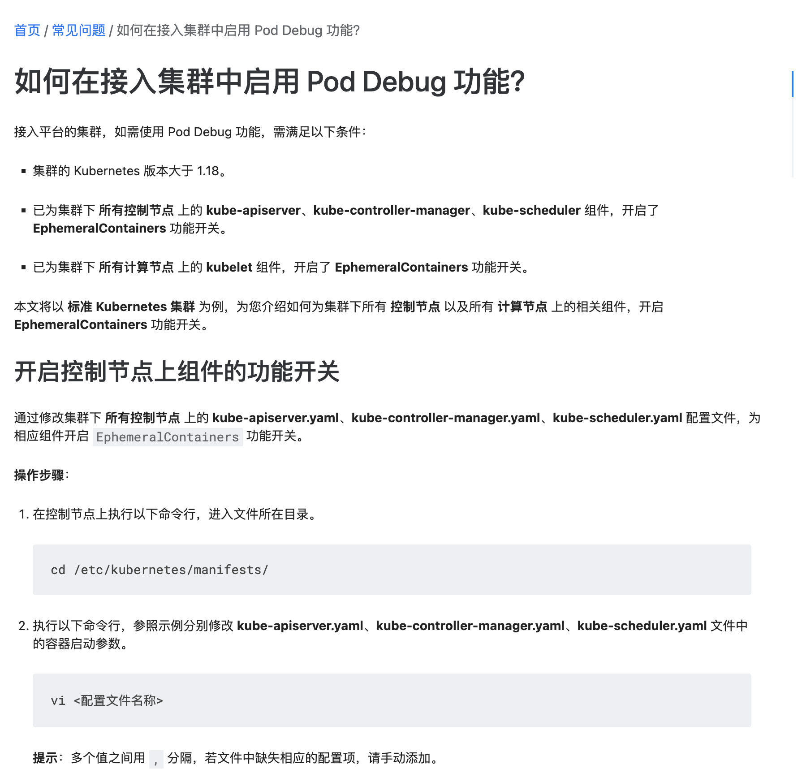

---
kind:
  - Troubleshooting
products:
  - Alauda Container Platform
  - Alauda DevOps
  - Alauda AI
  - Alauda Application Services
  - Alauda Service Mesh
  - Alauda Developer Portal
ProductsVersion:
  - 4.1.0,4.2.x
---
<!-- A type of document that involves encountering a fault, diagnosing it, performing root cause analysis, and providing solutions. -->

# 容器云容器debug功能问题咨询

JIRA Jira：

## Cause

## Resolution
- 访问功能开关页面：https://集群地址/console-platform/feature-gate 控制debug功能开关
- 接入集群需参考帮助文档《如何在接入集群中启用 Pod Debug 功能？》

## [workaround]

## [Related Information]
**Screenshots**

- Environment: 3.14.2
- /console-platform/feature-gate
- Debug调试容器（Alpha）
- 如何在接入集群中启用 Pod Debug 功能？
- Pod Debug
- Component: (待归类)
- Page ID: 327812213
- Original Title: 容器平台-容器云容器debug功能问题咨询-114718
