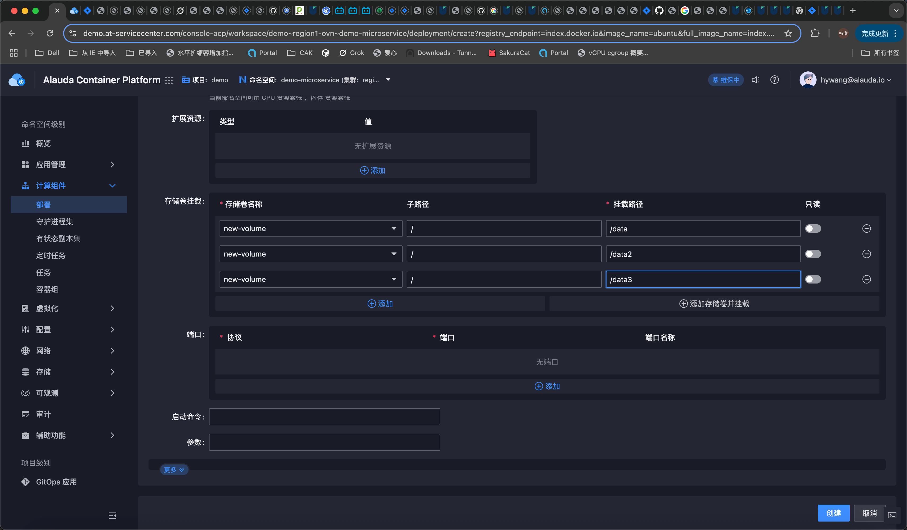

---
kind:
  - Troubleshooting
products:
  - Alauda Container Platform
  - Alauda DevOps
  - Alauda AI
  - Alauda Application Services
  - Alauda Service Mesh
  - Alauda Developer Portal
ProductsVersion:
  - 4.1.0,4.2.x
---
<!-- A type of document that involves encountering a fault, diagnosing it, performing root cause analysis, and providing solutions. -->

# 容器挂载pvc卷失败

pod创建时挂载pvc卷失败

## Cause
- 同一个pod多次声明同一个pvc存储

## Resolution
- 在声明存储时使用子路径(subPath)进行存储拆分

## [workaround]

## [Related Information]
**Screenshots**

- Environment: 3.6.2
- pvc
- pv
- volumeMounts
- subPath
- Component: (待归类)
- Page ID: 327812457
- Original Title: 容器平台-应用管理-其他-容器挂载pvc卷失败-114544
