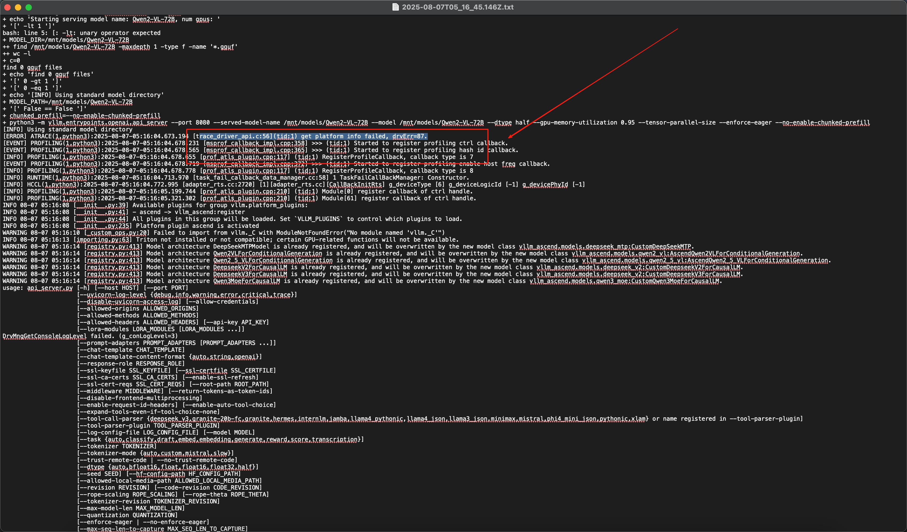

---
kind:
  - Troubleshooting
products:
  - Alauda Container Platform
  - Alauda DevOps
  - Alauda AI
  - Alauda Application Services
  - Alauda Service Mesh
  - Alauda Developer Portal
ProductsVersion:
  - 4.1.0,4.2.x
---
<!-- A type of document that involves encountering a fault, diagnosing it, performing root cause analysis, and providing solutions. -->

# hami+910部署qwen2

模型启动失败 错误日志显示底层设备识别异常 无法识别底层 NPU 信息

## Cause
- 底层 NPU 设备识别异常
- 需要 NPU 提供侧进行硬件/驱动层排查

## Resolution
- 联系底层 NPU 支持团队进行设备识别异常排查
- 检查 NPU 驱动版本与模型要求的兼容性

## [workaround]

## [Related Information]
**Screenshots**

- Environment: aml1.3 版本环境，hami+910 部署平台，深智城语料项目
- npu
- qwen2-vl-72b
- hami
- aml1.3
- Component: (待归类)
- Page ID: 327812481
- Original Title: 微服务-AI-hami+910部署qwen2-vl-72B报错-114637
