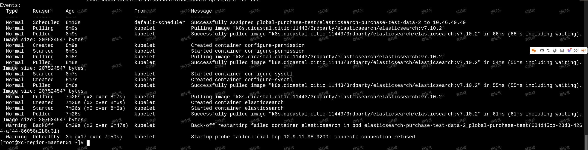

---
kind:
  - Troubleshooting
products:
  - Alauda Container Platform
  - Alauda DevOps
  - Alauda AI
  - Alauda Application Services
  - Alauda Service Mesh
  - Alauda Developer Portal
ProductsVersion:
  - 4.1.0,4.2.x
---
<!-- A type of document that involves encountering a fault, diagnosing it, performing root cause analysis, and providing solutions. -->

# es

CrashLoopBackoff

## Cause
- 资源请求(request)设置过高

## Resolution
- 将资源请求(request)调小后重新部署成功

## [workaround]

## [Related Information]
**Screenshots**

- Environment: 3.18.1
- Component: (待归类)
- Page ID: 327812578
- Original Title: 数据服务-Elasticserach-es-data服务一直CrashLoopBackoff-114526
