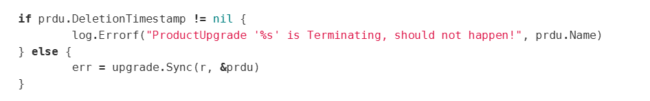
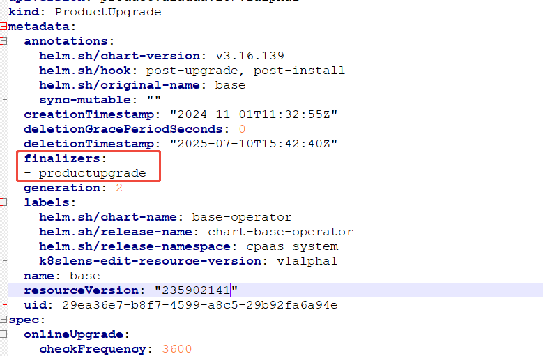

---
kind:
  - Troubleshooting
products:
  - Alauda Container Platform
  - Alauda DevOps
  - Alauda AI
  - Alauda Application Services
  - Alauda Service Mesh
  - Alauda Developer Portal
ProductsVersion:
  - 4.1.0,4.2.x
---
<!-- A type of document that involves encountering a fault, diagnosing it, performing root cause analysis, and providing solutions. -->

# base

ERROR controllers/productupgrade_controller.go:79 ProductUpgrade 'base' is Terminating, should not happen! ProductUpgrade resource stuck in Terminating state

## Cause
- ProductUpgrade 'base' resource has deletionTimestamp set with existing finalizers

## Resolution
- Backup YAML: `kubectl get productupgrade base -oyaml > productupgrade.yaml`
- Remove finalizers via `kubectl edit productupgrade base`
- Reapply resource: `kubectl apply -f productupgrade.yaml`

## [workaround]

## [Related Information]
**Screenshots**

``
- Environment: 3.16.2
- productupgrade
- base-operator
- finalizers
- controllers/productupgrade_controller.go
- Component: (待归类)
- Page ID: 330465764
- Original Title: 基础架构-产品组件-base-operator status error in logs-1869
