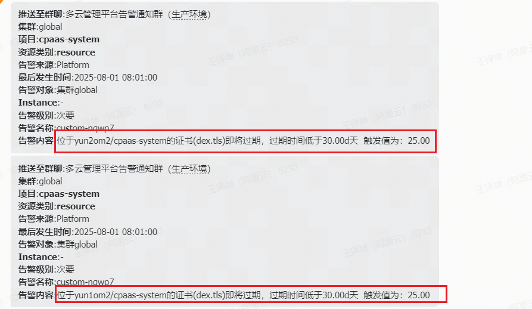

---
kind:
  - Troubleshooting
products:
  - Alauda Container Platform
  - Alauda DevOps
  - Alauda AI
  - Alauda Application Services
  - Alauda Service Mesh
  - Alauda Developer Portal
ProductsVersion:
  - 4.1.0,4.2.x
---
<!-- A type of document that involves encountering a fault, diagnosing it, performing root cause analysis, and providing solutions. -->

# dex.tls和sentry

证书即将到期触发告警

## Cause
- sentry-serving-cert证书自动续期机制异常
- dex.tls关联的域名证书未及时更新

## Resolution
- 检查cert-manager组件是否正常工作
- 获取最新域名证书并替换dex.tls证书

## [workaround]

## [Related Information]
**Screenshots**

- Environment: 4.0.2
- cert-manager
- dex
- sentry
- sentry-serving-cert
- dex.tls
- Component: (待归类)
- Page ID: 330465806
- Original Title: 基础架构-dex.tls和sentry-serving-cert这俩证书是干什么，快到期了，一直触发告警-114508
