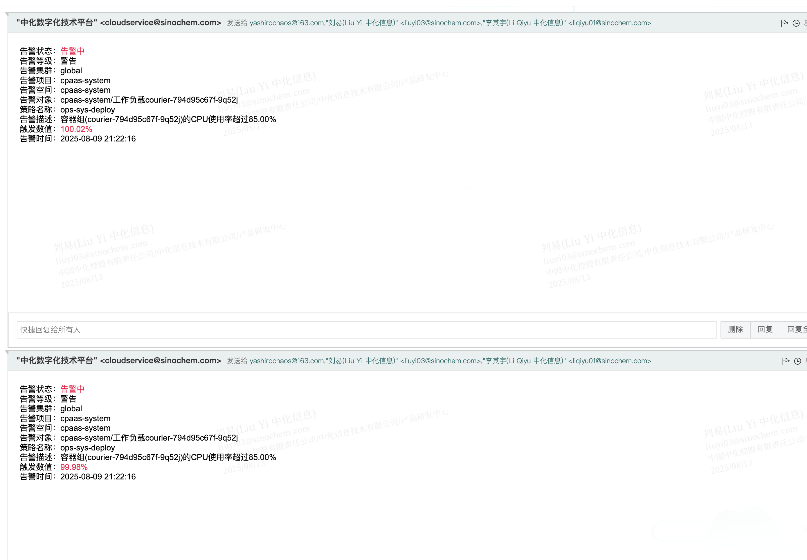

---
kind:
  - Troubleshooting
products:
  - Alauda Container Platform
  - Alauda DevOps
  - Alauda AI
  - Alauda Application Services
  - Alauda Service Mesh
  - Alauda Developer Portal
ProductsVersion:
  - 4.1.0,4.2.x
---
<!-- A type of document that involves encountering a fault, diagnosing it, performing root cause analysis, and providing solutions. -->

# global集群组件courier频繁告警

courier组件内存使用率过高

## Cause
- 内存资源不足

## Resolution
- 调整组件内存limit值
- 对courier组件进行资源扩容

## [workaround]

## [Related Information]
**Screenshots**

- Environment: 3.14.1
- courier
- Component: (待归类)
- Page ID: 330466112
- Original Title: 基础架构-运维中心-global集群组件courier频繁告警-115069
