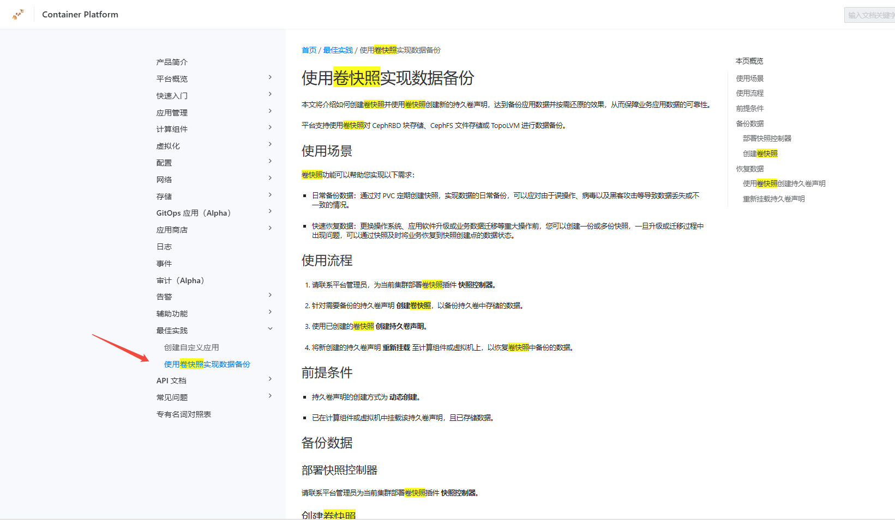

---
kind:
  - Troubleshooting
products:
  - Alauda Container Platform
  - Alauda DevOps
  - Alauda AI
  - Alauda Application Services
  - Alauda Service Mesh
  - Alauda Developer Portal
ProductsVersion:
  - 4.1.0,4.2.x
---
<!-- A type of document that involves encountering a fault, diagnosing it, performing root cause analysis, and providing solutions. -->

# 持久卷存储数据有备份么

JIRA Jira：

## Cause

## Resolution
- 使用卷快照功能实现数据备份，参考容器平台在线帮助文档-使用卷快照实现数据备份部分

## [workaround]

## [Related Information]
**Screenshots**

- Environment: 3.16.2
- 卷快照控制器
- PersistentVolumeClaim
- 193.4.102.252:/sfs-mzj-zhmzythjszcpt-0001/pvc-1e49ff78-82a0-441b-bc91-1de306515ff0
- Component: (待归类)
- Page ID: 330466193
- Original Title: 容器平台-存储-其他（容器对象存储接口/快照控制器）-持久卷存储数据有备份么-115054
