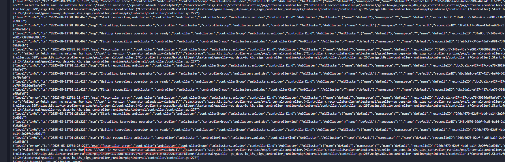
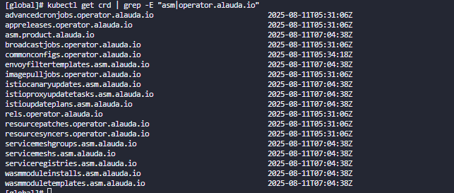

---
kind:
  - Troubleshooting
products:
  - Alauda Container Platform
  - Alauda DevOps
  - Alauda AI
  - Alauda Application Services
  - Alauda Service Mesh
  - Alauda Developer Portal
ProductsVersion:
  - 4.1.0,4.2.x
---
<!-- A type of document that involves encountering a fault, diagnosing it, performing root cause analysis, and providing solutions. -->

# 4.0 部署aml失败

failed to install kserveless operator: context deadline exceeded kubectl get amlcluster default 显示状态为 False，原因为 Failed

## Cause
- 未部署服务网格导致缺少 asm.asm.operator.alauda.io/v1alpha1 CRD 资源

## Resolution
- 部署服务网格以补全缺失的 CRD 资源

## [workaround]

## [Related Information]
**Screenshots**

- Environment: 4.0.1
- asm.asm.operator.alauda.io/v1alpha1
- 服务网格
- Component: (待归类)
- Page ID: 330466229
- Original Title: 微服务-4.0 部署aml失败-114931
